# สูตร mermaid ต่อชนิด diagram

Mermaid ไม่มีชนิด diagram สำหรับ DFD, BPMN และ Use Case โดยตรง — สามอันนี้เขียนด้วย `flowchart` ตามธรรมเนียมรูปทรงที่กำหนดไว้ด้านล่าง ใช้ให้เหมือนกันทั้งเอกสารเพื่อให้ผู้อ่านจำรูปทรงได้

| Diagram ที่ต้องการ | ชนิด mermaid | ธรรมเนียมรูปทรง |
|---|---|---|
| System Context / DFD Level 0–2 | `flowchart` | external entity `["…"]` · process `(("…"))` · data store `[("…")]` |
| BPMN As-Is / To-Be | `flowchart` + `subgraph` เป็น lane | event `(("…"))` · task `["…"]` · gateway `{"…"}` · end `((("…")))` |
| Stakeholder Map | `mindmap` | — |
| Use Case Diagram | `flowchart` + `subgraph` เป็นขอบเขตระบบ | actor `(["…"])` · use case `(("…"))` · association `---` |
| Activity Diagram | `flowchart TD` | decision `{"…"}` |
| State Diagram | `stateDiagram-v2` | — |
| Workload / Concurrent User | `xychart-beta` | — |
| Conceptual ERD | `erDiagram` | — |
| Wireframe | `block-beta` | — |
| Integration / Interface | `flowchart` + `subgraph` เป็นโซน | — |
| ลำดับการเรียก API | `sequenceDiagram` | — |

ตัวอย่างทั้งหมดด้านล่างใช้โดเมนระบบจองห้องประชุมเป็นตัวอย่าง เปลี่ยนเนื้อในให้ตรงโดเมนจริง แต่คงโครงและรูปทรงไว้

---

## System Context Diagram (DFD Level 0)

ระบบเป็น process เดียวหมายเลข 0 ล้อมด้วย external entity และทุกเส้นต้องมีชื่อ data flow

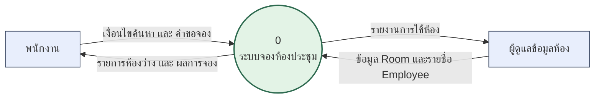

## DFD Level 1

แตก process 0 เป็น 1.0, 2.0, … เลข Level 2 ต้องสืบจากเลขแม่ (1.0 → 1.1, 1.2)

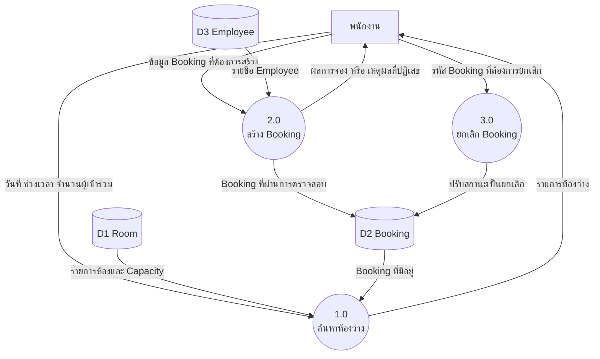

## BPMN — As-Is และ To-Be

ใช้ `subgraph` หนึ่งอันต่อหนึ่ง lane และ **ใช้ lane ชุดเดียวกันทั้งสองภาพ** เพื่อให้เทียบกันได้

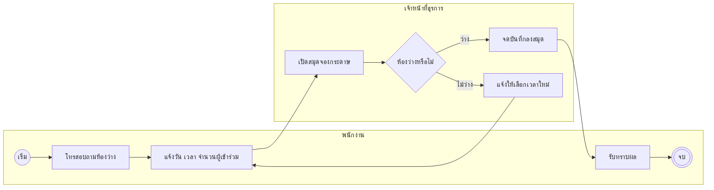

ภาพ To-Be ใช้โครงเดียวกัน แต่แทน task ที่คนทำด้วย task ของระบบ และใต้ภาพต้องมีย่อหน้าสรุปว่าขั้นตอนไหนหายไปและเวลาที่ประหยัดได้

## Stakeholder Map

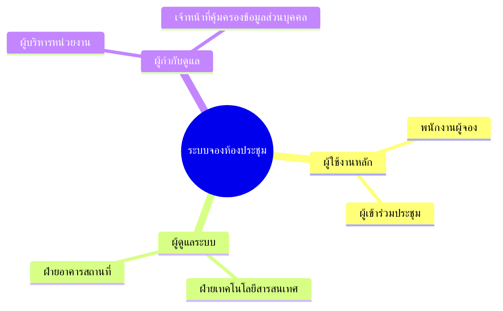

## Use Case Diagram

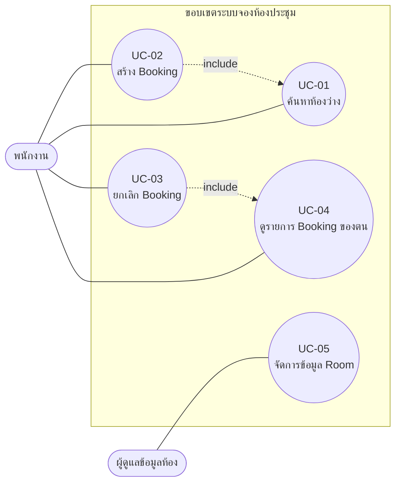

## Activity Diagram

decision node ต้องครบทุกกรณีที่ระบุใน Exception Flows ของ Use Case Description

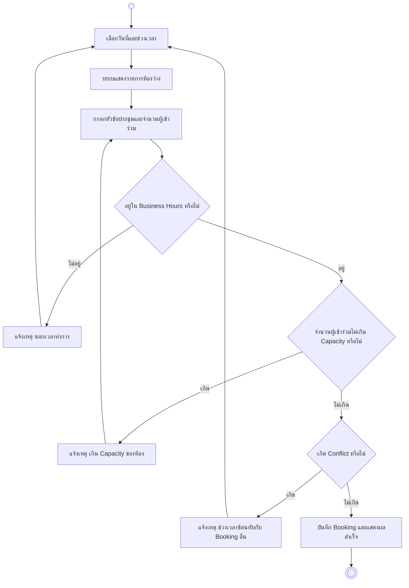

## State Diagram

ชื่อสถานะภาษาไทยต้องประกาศด้วย `state "…" as ID` เพราะ ID ต้องเป็น ASCII

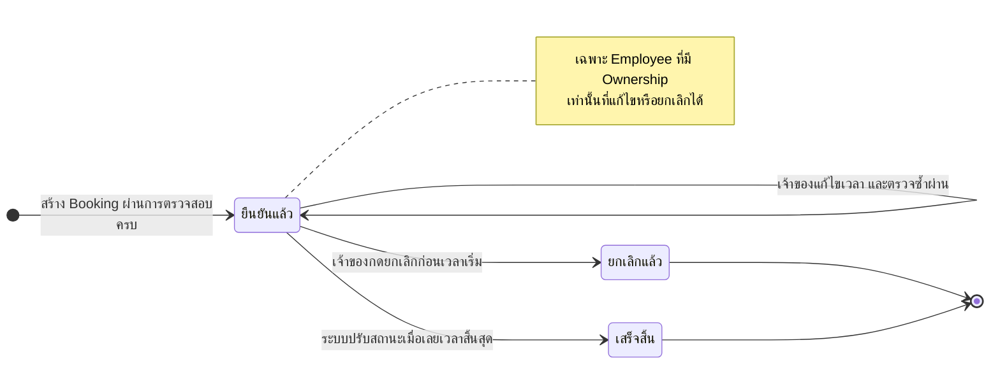

## Workload / Concurrent User Chart

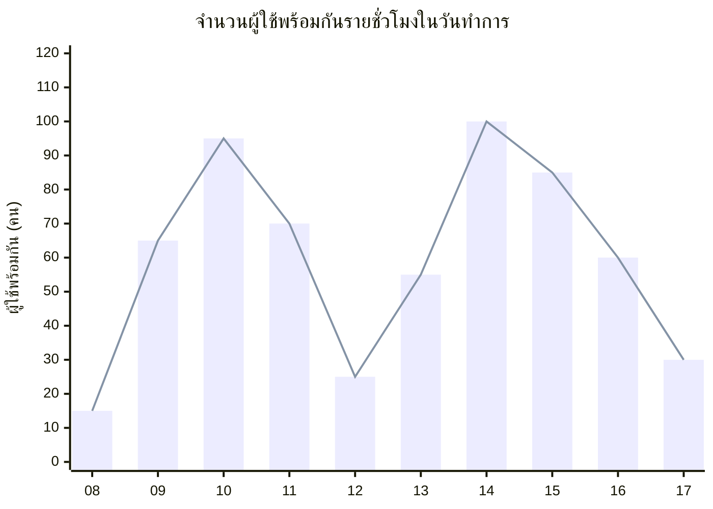

ใต้ภาพต้องระบุชั่วโมงเร่งด่วน (peak) และผูกตัวเลข peak เข้ากับรหัส `NFR-PERF-*` ที่กำหนดจำนวนผู้ใช้พร้อมกัน

## Conceptual ERD

ชื่อ entity และ attribute เป็น ASCII เท่านั้น ชื่อภาษาไทยไปอยู่ในตาราง Data Dictionary

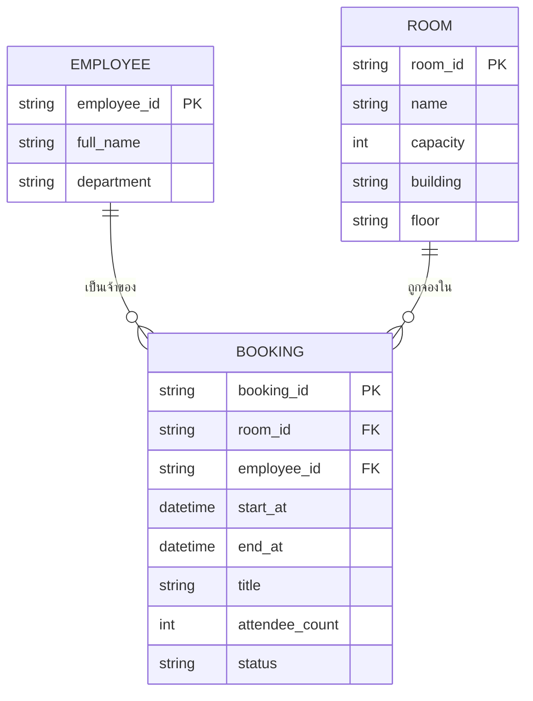

## Wireframe

ระดับกล่องและตำแหน่งเท่านั้น ไม่ลงสีหรือฟอนต์

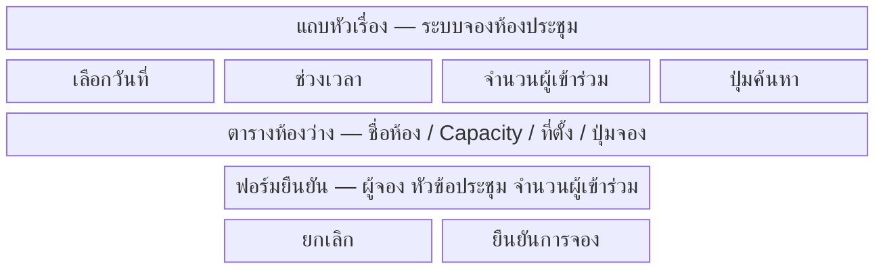

## Integration / Interface Diagram

ทุกเส้นต้องระบุโปรโตคอลและรูปแบบข้อมูล เส้นประ = ยังไม่เชื่อมต่อในเฟสนี้

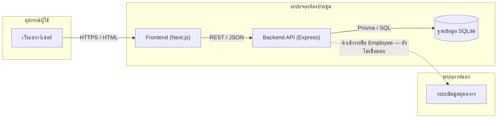

## Sequence Diagram (ประกอบตาราง API)

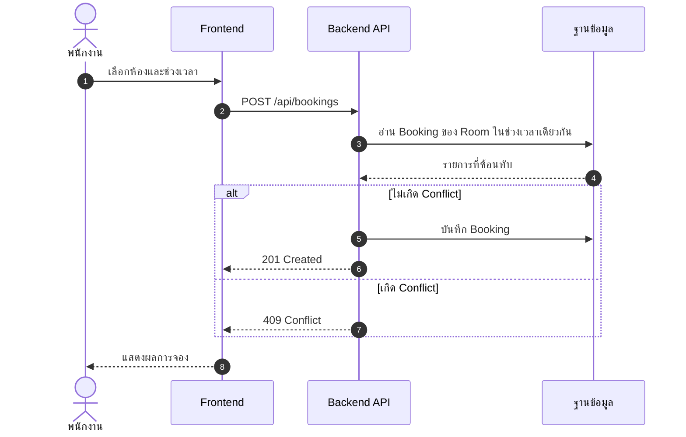

---

## รายการดักพลาด

หกข้อแรกทำให้ **ทั้งภาพพัง** (ทดสอบกับ mermaid 11 แล้ว) สองข้อท้ายเป็นธรรมเนียมของเอกสารชุดนี้

1. **Node ID ต้องเป็น ASCII** — `ค้นหา["ก"]` ทำให้ทั้งภาพพังด้วย lexical error ทั้งในและนอก `subgraph` ข้อความไทยอยู่ในรูปทรงเท่านั้น: `A1["ค้นหาห้องว่าง"]`
2. **ห่อ label ทุกอันด้วย `"…"`** ทั้งของ node และของเส้น (`-->|"…"|`) — กฎข้อเดียวนี้ครอบคลุมอักขระพิเศษทั้งหมด `( )` และ `{ }` ที่ไม่ห่อพังแน่นอน ส่วน `# , ; : /` รอดได้แต่ไม่ต้องเสี่ยง
3. **`"` ในข้อความใช้ `#quot;`** — ใส่ `"` ตรง ๆ ในสตริงที่ห่อไว้แล้วทำให้ parse พัง; ขึ้นบรรทัดใหม่ใช้ `<br/>`
4. **`end` ตัวพิมพ์เล็กลอย ๆ เป็น node ทำให้พัง** เพราะชนกับตัวปิด `subgraph` — ถ้าต้องใช้เป็นข้อความให้ห่อเป็น `B1["end"]`
5. **`%%` ต้องอยู่ต้นบรรทัดของตัวเอง** ต่อท้ายบรรทัดอื่นทำให้ parse พัง
6. **`mindmap` เยื้องด้วย space ล้วน** ถ้ามี tab ปนจะได้ error `There can be only one root`
7. **`<` ที่ติดตัวอักษรทันที** (`<b`, `<bold>`) ถูกอ่านเป็น HTML tag แล้วข้อความหายไปตอน render — เขียนเป็นคำ ("ไม่เกิน", "มากกว่า") ส่วน `<=` และ `<` ที่มีเว้นวรรคตามหลังปลอดภัย
8. **`stateDiagram-v2` ประกาศ `state "ชื่อไทย" as ID`** และ **`erDiagram` ใช้ชื่อ entity/attribute เป็น ASCII** — parser รับภาษาไทยได้ทั้งคู่ แต่เอกสารชุดนี้ต้องอ้างรหัสสถานะและชื่อ attribute ข้ามบท (State Diagram ↔ บทที่ 3, ERD ↔ Data Dictionary บทที่ 5) จึงต้องมี ID ที่คงที่

## ตรวจจริงด้วยสคริปต์

```
node .claude/skills/srs/scripts/check-mermaid.mjs docs/sds
```

รับได้ทั้งไฟล์และโฟลเดอร์ รายงานเป็น `ไฟล์:บรรทัด` ของบล็อกที่พัง และคืน exit code ไม่เป็นศูนย์เมื่อมีบล็อกไม่ผ่าน
ครั้งแรกจะติดตั้ง mermaid + jsdom ลงโฟลเดอร์ชั่วคราวของระบบ ไม่แตะ `package.json` ของโปรเจกต์
สคริปต์ตรวจ **ไวยากรณ์** เท่านั้น ข้อ 7 (การ render) ยังต้องอาศัยการอ่านด้วยตา
