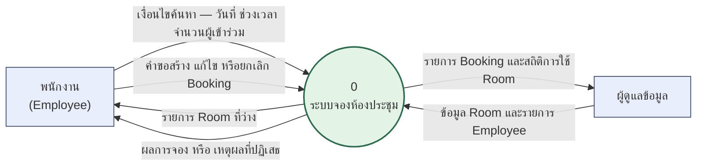
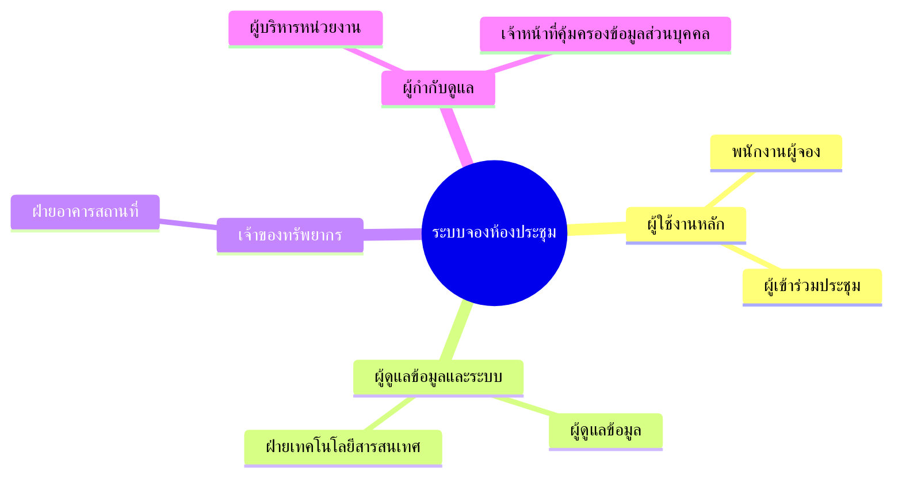
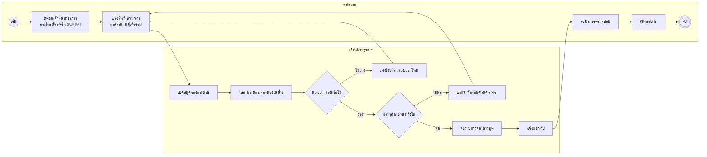
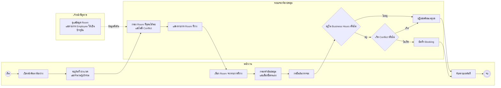

# บทที่ 2 ภาพรวมระบบ

## 2.1 มุมมองผลิตภัณฑ์

ระบบจองห้องประชุมเป็นระบบใหม่ที่สร้างขึ้นทดแทนกระบวนการจองด้วยสมุดกระดาษผ่านเจ้าหน้าที่ธุรการ ระบบทำงานเป็นเว็บแอปพลิเคชันภายในองค์กร ติดตั้งบนเครื่องแม่ข่ายขององค์กรเอง (self-host) และไม่เชื่อมต่อกับระบบภายนอกใดในระยะแรก ข้อมูลทั้งหมดที่ระบบใช้ ได้แก่ รายการ Room และรายการ Employee เป็นข้อมูลที่ผู้ดูแลข้อมูลเตรียมไว้ล่วงหน้าในระบบ

ระบบวางตัวเป็นเจ้าของข้อมูล Booking เพียงแหล่งเดียวขององค์กร กฎการจองสามข้อ — Business Hours, Capacity และ Conflict — ถูกบังคับที่ระบบเท่านั้น ไม่มีการบังคับซ้ำที่ขั้นตอนของคน

**ภาพที่ 2-1 System Context Diagram (DFD Level 0)** — ระบบมีผู้เกี่ยวข้องภายนอกเพียงสองกลุ่มและไม่มีระบบภายนอกเชื่อมต่อเลย กระแสข้อมูลเข้าออกทั้งหกเส้นครอบคลุมทุกสิ่งที่ระบบรับและส่งออก การไม่มีเส้นเชื่อมไปยังระบบข้อมูลบุคลากรเป็นผลจากการที่รายการ Employee เป็นข้อมูลที่เตรียมไว้ล่วงหน้า (ที่มา: ADR-0002)

## 2.2 ผู้ใช้งานและผู้มีส่วนได้ส่วนเสีย

| กลุ่มผู้มีส่วนได้ส่วนเสีย | บทบาทต่อระบบ | ความคาดหวังหลัก | ระดับอิทธิพล | ความถี่การใช้งาน |
|---|---|---|---|---|
| พนักงานผู้จอง | ผู้ใช้งานหลัก สร้าง แก้ไข และยกเลิก Booking ของตน | จองห้องได้เสร็จภายในไม่กี่ขั้นตอน โดยไม่ต้องรอใคร | สูง | ทุกวัน |
| ผู้เข้าร่วมประชุม | ผู้รับผลจาก Booking ที่ผู้อื่นสร้าง | ทราบว่าประชุมที่ห้องใด เวลาใด | ต่ำ | ทุกวัน |
| ผู้ดูแลข้อมูล (เจ้าหน้าที่ธุรการ) | ดูแลรายการ Room และรายการ Employee ให้เป็นปัจจุบัน | แก้ไขข้อมูลห้องได้เองโดยไม่ต้องพึ่งทีมพัฒนา | ปานกลาง | รายสัปดาห์ |
| ฝ่ายอาคารสถานที่ | เจ้าของทรัพยากร Room ทางกายภาพ | เห็นอัตราการใช้ห้องเพื่อวางแผนพื้นที่ | ปานกลาง | รายเดือน |
| ฝ่ายเทคโนโลยีสารสนเทศ | ติดตั้ง ดูแล และสำรองข้อมูลระบบ | ติดตั้งและกู้คืนได้ง่าย ไม่ต้องดูแลบริการฐานข้อมูลแยก | สูง | ต่อเนื่อง |
| ผู้บริหารหน่วยงาน | ผู้อนุมัติงบประมาณและขอบเขต | ลดเวลาที่เสียไปกับการประสานงานจองห้อง | สูง | รายไตรมาส |
| เจ้าหน้าที่คุ้มครองข้อมูลส่วนบุคคล | ตรวจความสอดคล้องกับ PDPA | ข้อมูลส่วนบุคคลถูกเก็บเท่าที่จำเป็นและมีกำหนดลบ | สูง | รายปี |

**ภาพที่ 2-2 Stakeholder Map** — ผู้มีส่วนได้ส่วนเสียแบ่งเป็นสี่กลุ่มตามความสัมพันธ์กับระบบ กลุ่มที่มีอิทธิพลสูงสามกลุ่ม (พนักงานผู้จอง ฝ่ายเทคโนโลยีสารสนเทศ และผู้กำกับดูแล) เป็นกลุ่มที่ความต้องการของเขาปรากฏเป็นข้อกำหนดโดยตรงในบทที่ 3 และบทที่ 4

## 2.3 กระบวนการทำงาน

### 2.3.1 กระบวนการปัจจุบัน (As-Is)

**ภาพที่ 2-3 BPMN กระบวนการปัจจุบัน (As-Is)** — จุดเจ็บปวดที่ภาพนี้ชี้ให้เห็นมีสี่ข้อ (1) พนักงานจองได้เฉพาะช่วงที่เจ้าหน้าที่ธุรการอยู่ปฏิบัติงาน (2) การตรวจช่วงเวลาว่างและความจุห้องอาศัยการอ่านและความจำของคน จึงเกิดการจองซ้อนได้ (3) สมุดกระดาษเล่มเดียวทำให้ดูสถานะห้องพร้อมกันหลายคนไม่ได้ และ (4) ทุกรอบที่ถูกปฏิเสธต้องวนกลับไปคุยกับเจ้าหน้าที่ธุรการใหม่ทั้งหมด

### 2.3.2 กระบวนการที่ออกแบบใหม่ (To-Be)

**ภาพที่ 2-4 BPMN กระบวนการที่ออกแบบใหม่ (To-Be)** — สิ่งที่เปลี่ยนไปคือเจ้าหน้าที่ธุรการหลุดออกจากเส้นทางการจองทั้งหมด เหลือเพียงงานดูแลข้อมูลตั้งต้นที่ทำเป็นครั้งคราว (เส้นประ) การตรวจสอบสามกฎที่เดิมอาศัยสายตาคนกลายเป็นขั้นตอนของระบบที่ทำทุกครั้งอย่างสม่ำเสมอ และวงวนการถูกปฏิเสธย่นจากการติดต่อคนใหม่ทั้งรอบ เหลือเป็นการแก้ข้อมูลบนหน้าจอเดิม พนักงานจองได้ตลอดเวลาโดยไม่ผูกกับเวลาปฏิบัติงานของเจ้าหน้าที่ธุรการ

## 2.4 ข้อจำกัด (Constraints)

| รหัส | ข้อจำกัด | ประเภท | ที่มา |
|---|---|---|---|
| CON-01 | ระบบรองรับองค์กรเดียว ไม่มีแนวคิดการแบ่งข้อมูลตามองค์กรใน data model | เทคนิค | ADR-0001 |
| CON-02 | ไม่มีการยืนยันตัวตน การระบุตัวตนทำโดยเลือกชื่อจากรายการ Employee ที่เตรียมไว้ | ธุรกิจ | ADR-0002 |
| CON-03 | การบังคับ Ownership อ้างอิงชื่อที่ผู้ใช้เลือกเอง ไม่ใช่ session ที่ผ่านการยืนยัน | เทคนิค | ADR-0002 |
| CON-04 | ใช้ SQLite เป็นฐานข้อมูล จึงรองรับการเขียนพร้อมกันจากหลาย process ได้จำกัด | เทคนิค | ADR-0003 |
| CON-05 | ติดตั้งแบบ instance เดียว ไม่รองรับการขยายแนวราบในระยะนี้ | เทคนิค | ADR-0003 |
| CON-06 | สถาปัตยกรรมแยกเป็นสอง service คือ Backend API และ Frontend ต้องติดตั้งพร้อมกันและตั้งค่า CORS | เทคนิค | ADR-0004 |
| CON-07 | Frontend ห้ามเข้าถึงฐานข้อมูลโดยตรง ต้องเรียกผ่าน REST API เท่านั้น | เทคนิค | ADR-0004 |
| CON-08 | Booking เป็นการจองครั้งเดียว ไม่รองรับการจองแบบเกิดซ้ำตามรอบ | ธุรกิจ | REF-01 (`CONTEXT.md`) |
| CON-09 | Booking หนึ่งรายการผูกกับ Room หนึ่งห้องและ Employee หนึ่งคนเท่านั้น | ธุรกิจ | REF-01 (`CONTEXT.md`) |
| CON-10 | ระบบต้องปฏิบัติตามพระราชบัญญัติคุ้มครองข้อมูลส่วนบุคคล พ.ศ. 2562 | กฎหมาย | REF-06 |

## 2.5 สมมติฐาน (Assumptions)

ทุกจุดที่ติดแท็ก `[ต้องยืนยัน]` ในเอกสารชุดนี้มีแถวอยู่ในตารางนี้ ต้องได้ข้อยุติจากผู้ว่าจ้างก่อนเริ่มพัฒนา

ผู้ว่าจ้าง/เจ้าของงานยืนยันสมมติฐานทั้ง 12 ข้อผ่านแบบสอบถาม (`to-questionnaire-booking-assumptions.md`) แล้ว ยกเว้น ASM-11 ที่มีเงื่อนไขเพิ่มเติมตามหมายเหตุ

| รหัส | สมมติฐาน | ผลกระทบถ้าสมมติฐานไม่จริง | สถานะ |
|---|---|---|---|
| ASM-01 | ยังไม่มีเอกสาร TOR รายการ TOR ในบทที่ 7 จึงสร้างขึ้นจากขอบเขตในหัวข้อ 1.2 | ต้องทำ RTM ใหม่ทั้งตารางเมื่อได้ TOR ฉบับจริง และขอบเขตงานอาจเปลี่ยน | ยืนยันแล้ว |
| ASM-02 | Business Hours ค่าเริ่มต้น 08:00–18:00 วันจันทร์ถึงศุกร์ เป็นค่าที่ผู้ดูแลข้อมูลตั้งค่าได้ ไม่ใช่ค่าตรึงตายในโปรแกรม | ถ้าเป็นค่าตรึงตาย ต้องตัด FR ที่เกี่ยวกับการตั้งค่าออก ถ้าต้องตั้งค่าแยกรายห้อง ต้องเพิ่มฟิลด์และข้อกำหนด | ยืนยันแล้ว |
| ASM-03 | องค์กรมี Room ประมาณ 20 ห้อง และ Employee ประมาณ 300 คน | ประมาณการปริมาณข้อมูลในหัวข้อ 5.3 และเกณฑ์ประสิทธิภาพในหัวข้อ 4.1 ต้องคำนวณใหม่ | ยืนยันแล้ว |
| ASM-04 | ผู้ใช้พร้อมกันสูงสุดไม่เกิน 100 คน โดยช่วงเร่งด่วนอยู่ที่ 09:00–10:00 และ 13:00–14:00 | เกณฑ์ `NFR-PERF-*` ทั้งหมดต้องกำหนดใหม่ และข้อจำกัด CON-04 อาจกลายเป็นอุปสรรค | ยืนยันแล้ว |
| ASM-05 | ระบบใช้เขตเวลา Asia/Bangkok เพียงเขตเดียว | ต้องเพิ่มการจัดการเขตเวลาในทุกจุดที่คำนวณ Business Hours และ Conflict | ยืนยันแล้ว |
| ASM-06 | Booking หนึ่งรายการยาวอย่างน้อย 30 นาที และไม่เกิน 4 ชั่วโมง โดยเริ่มและจบที่นาทีที่ 00 หรือ 30 | กฎการตรวจสอบใน `FR-BKG-08` และรูปแบบตัวเลือกเวลาบนหน้าจอต้องเปลี่ยน | ยืนยันแล้ว |
| ASM-07 | Room มีสถานะเปิดและปิดการใช้งานชั่วคราว เพื่อรองรับกรณีห้องปิดปรับปรุง | ถ้าไม่ต้องการ ให้ตัด `FR-ROOM-05` และ State Diagram ของ Room ในหัวข้อ 3.1 ออก | ยืนยันแล้ว |
| ASM-08 | ระยะเวลาเก็บข้อมูล Booking ย้อนหลัง 2 ปี แล้วลบข้อมูลส่วนบุคคลออก | ตารางการเก็บรักษาในหัวข้อ 5.4 และข้อกำหนด `NFR-PDPA-*` ต้องกำหนดใหม่ | ยืนยันแล้ว |
| ASM-09 | ระบบให้บริการเฉพาะภายในเครือข่ายองค์กร ไม่เปิดสู่อินเทอร์เน็ตสาธารณะ | ความเสี่ยงจาก CON-02 และ CON-03 จะรุนแรงขึ้นมาก ต้องเพิ่มการยืนยันตัวตนก่อนใช้งานจริง | ยืนยันแล้ว |
| ASM-10 | ระดับความพร้อมใช้งานที่ต้องการคือ 99.0% ในเวลาทำการ และหยุดบำรุงรักษาได้นอกเวลาทำการ | เกณฑ์ `NFR-AVL-*` ต้องกำหนดใหม่ และ CON-05 อาจต้องทบทวน | ยืนยันแล้ว |
| ASM-11 | หน้าจอสำหรับผู้ดูแลข้อมูลเข้าถึงได้ด้วยการจำกัดที่ระดับเครือข่าย เนื่องจากระบบไม่มีการยืนยันตัวตน | ต้องเพิ่มกลไกจำกัดสิทธิ์ ซึ่งขัดกับ ADR-0002 และต้องทบทวนข้อตัดสินใจนั้น | ยืนยันแล้ว (มีเงื่อนไข) |
| ASM-12 | ระบบไม่ต้องแจ้งเตือนผ่านอีเมลหรือปฏิทินภายนอก | ต้องเพิ่มโมดูลแจ้งเตือนและระบบภายนอกในหัวข้อ 6.2 ซึ่งเปลี่ยนภาพที่ 2-1 | ยืนยันแล้ว |

**หมายเหตุ ASM-11:** ผู้ว่าจ้างยืนยันว่าเฟสนี้ไม่มีหน้า login สำหรับผู้ดูแลข้อมูล (จำกัดสิทธิ์ที่ระดับเครือข่ายตามเดิม) แต่แจ้งว่ามีแผนเพิ่มระบบยืนยันตัวตนในอนาคต — เป็นงานนอกขอบเขตของเฟสนี้ แต่ทีมพัฒนาควรออกแบบ `FR-ADM-*` และ ADR-0002 โดยไม่ปิดทางสำหรับการเพิ่ม authentication ภายหลัง

---

[← บทที่ 1 บทนำ](01-introduction.md) · [สารบัญ](README.md) · [บทที่ 3 ความต้องการเชิงหน้าที่ →](03-functional-requirements.md)
