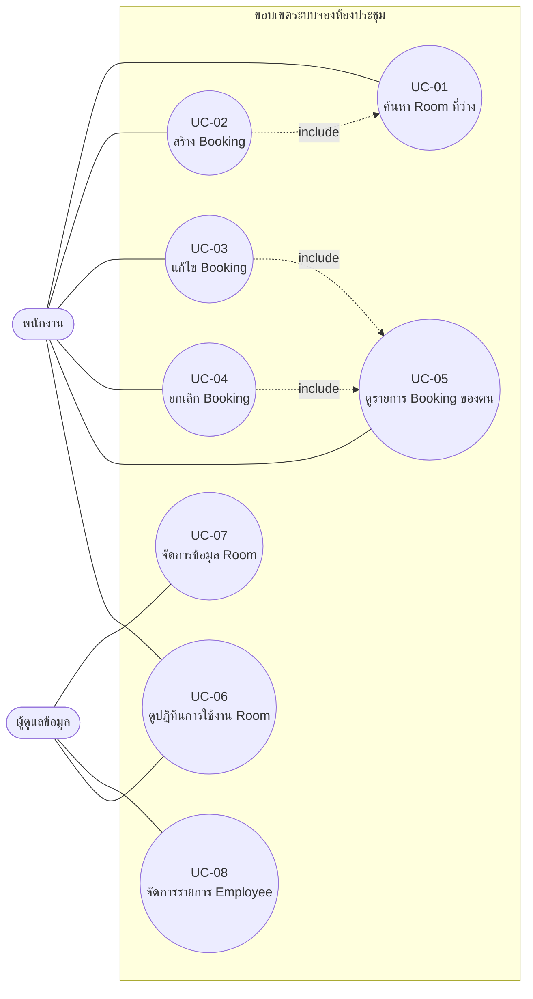
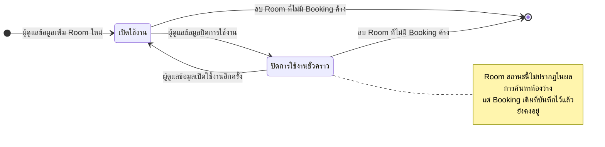
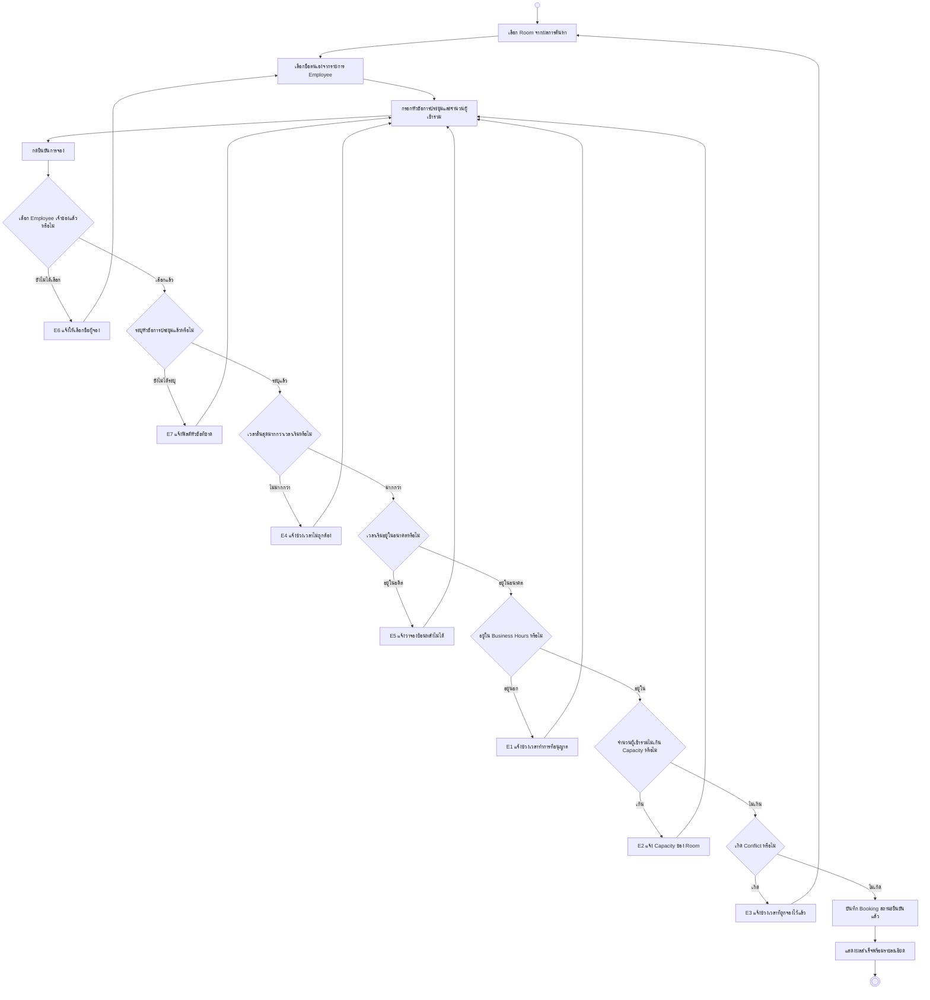
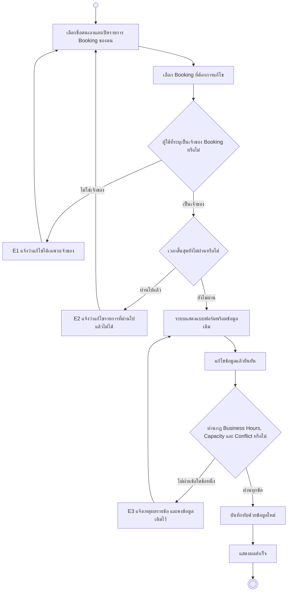
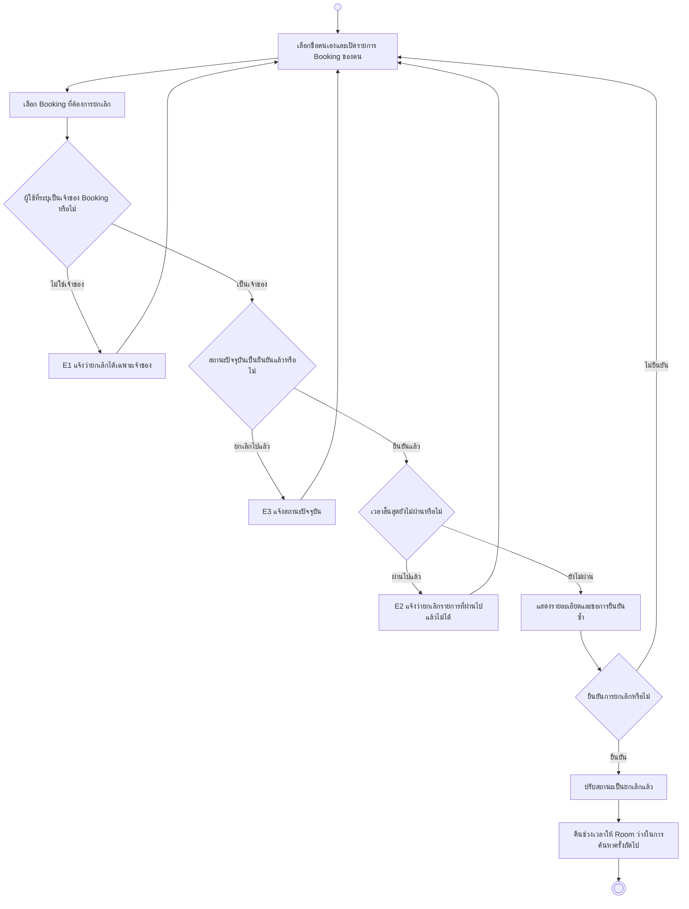
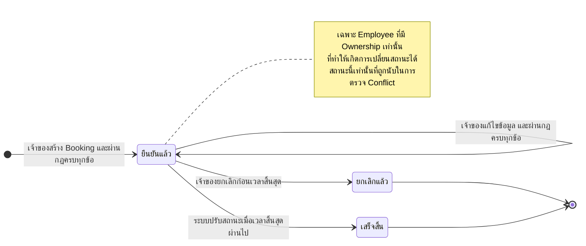
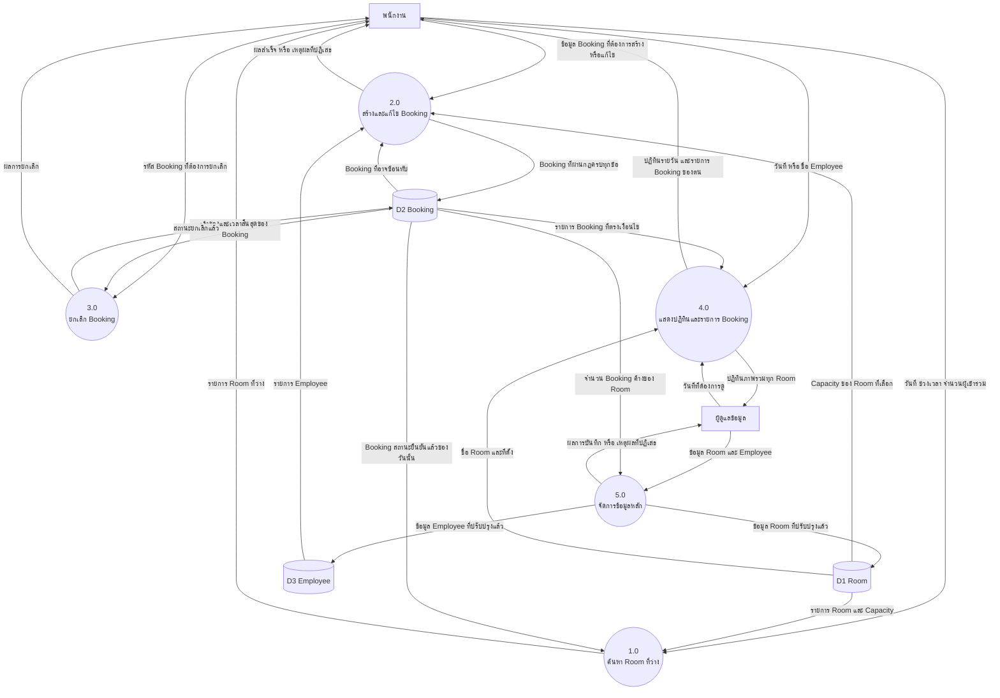
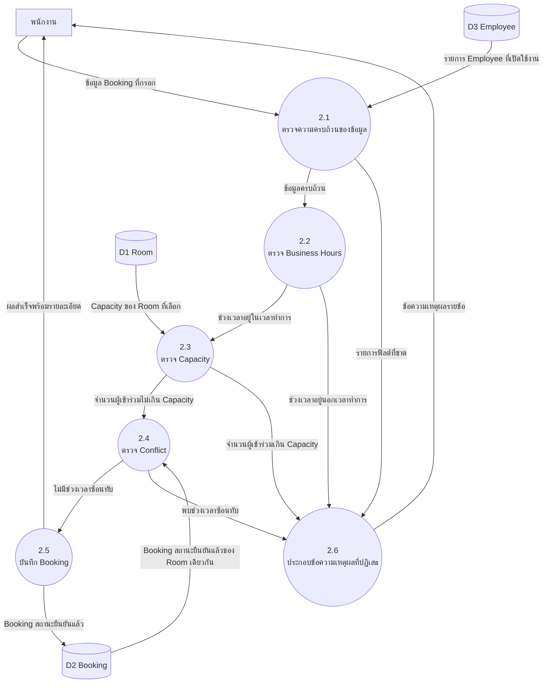

# บทที่ 3 ความต้องการเชิงหน้าที่

## 3.1 ภาพรวม

ความต้องการเชิงหน้าที่แบ่งตามหน่วยความหมายหลัก (aggregate) ที่นิยามไว้ใน `CONTEXT.md` สามหน่วย

| รหัสโมดูล | ชื่อโมดูล | ขอบเขตความรับผิดชอบ | ช่วงรหัส | จำนวน |
|---|---|---|---|---|
| `ROOM` | จัดการ Room | ข้อมูลห้องประชุม Capacity ที่ตั้ง และสถานะการเปิดใช้งาน | `FR-ROOM-01` ถึง `FR-ROOM-07` | 7 |
| `EMP` | จัดการ Employee | รายการพนักงานที่ใช้ระบุเจ้าของ Booking | `FR-EMP-01` ถึง `FR-EMP-05` | 5 |
| `BKG` | จัดการ Booking | การค้นหาห้องว่าง สร้าง แก้ไข ยกเลิก และดู Booking รวมถึงการบังคับกฎทั้งสามข้อ | `FR-BKG-01` ถึง `FR-BKG-18` | 18 |

รวมทั้งสิ้น **30 ข้อกำหนดเชิงหน้าที่** และ **8 กรณีการใช้งาน**

ระดับความสำคัญที่ใช้ในตารางทุกโมดูล — **บังคับ** คือไม่มีไม่ได้ ต้องส่งมอบในเฟสแรก · **ควรมี** คือส่งมอบได้ในเฟสแรกถ้าเวลาพอ ไม่กระทบการใช้งานหลักถ้าเลื่อน

**ภาพที่ 3-1 Use Case Diagram** — พนักงานเข้าถึงกรณีการใช้งานหกกรณีที่เกี่ยวกับ Booking ของตนเอง ผู้ดูแลข้อมูลเข้าถึงกรณีการจัดการข้อมูลตั้งต้นและปฏิทินภาพรวม เส้นประ `include` แสดงว่าการสร้าง Booking ต้องผ่านการค้นหาห้องว่างก่อนเสมอ และการแก้ไขหรือยกเลิกต้องเริ่มจากการเรียกดูรายการ Booking ของตนเสมอ เนื่องจากไม่มีการยืนยันตัวตน ผู้กระทำทั้งสองจึงแยกกันด้วยหน้าจอที่เข้าถึงเท่านั้น ไม่ได้แยกด้วยสิทธิ์ที่ระบบตรวจสอบ (ที่มา: ADR-0002, CON-03)

---

## 3.2 โมดูล ROOM — จัดการ Room

### 3.2.1 ตารางความต้องการ

| รหัส | ชื่อฟังก์ชัน | รายละเอียด | ความสำคัญ | Use Case |
|---|---|---|---|---|
| `FR-ROOM-01` | แสดงรายการ Room | ระบบต้องแสดงรายการ Room ทั้งหมด พร้อมชื่อห้อง Capacity อาคาร และชั้น | บังคับ | UC-01, UC-07 |
| `FR-ROOM-02` | กรอง Room ตามที่ตั้ง | ระบบต้องให้กรองรายการ Room ตามอาคารและตามชั้นได้ | ควรมี | UC-01 |
| `FR-ROOM-03` | เพิ่ม Room | ระบบต้องให้ผู้ดูแลข้อมูลเพิ่ม Room ใหม่ โดยระบุชื่อห้อง Capacity อาคาร และชั้น | บังคับ | UC-07 |
| `FR-ROOM-04` | แก้ไขข้อมูล Room | ระบบต้องให้ผู้ดูแลข้อมูลแก้ไขชื่อห้อง Capacity อาคาร และชั้นของ Room ที่มีอยู่ | บังคับ | UC-07 |
| `FR-ROOM-05` | ปิดการใช้งาน Room ชั่วคราว | ระบบต้องให้ผู้ดูแลข้อมูลปรับสถานะ Room เป็นปิดการใช้งาน และต้องไม่แสดง Room ที่ปิดการใช้งานในผลการค้นหาห้องว่าง `[ต้องยืนยัน — ASM-07]` | ควรมี | UC-07 |
| `FR-ROOM-06` | ป้องกันการลบ Room ที่มี Booking ค้าง | ระบบต้องปฏิเสธการลบ Room ที่มี Booking สถานะยืนยันแล้วซึ่งเวลาสิ้นสุดยังไม่ผ่าน พร้อมแจ้งจำนวนรายการที่ค้างอยู่ | บังคับ | UC-07 |
| `FR-ROOM-07` | ป้องกันการลด Capacity ต่ำกว่าที่จองไว้ | ระบบต้องปฏิเสธการแก้ไข Capacity ของ Room ให้น้อยกว่าจำนวนผู้เข้าร่วมของ Booking สถานะยืนยันแล้วที่เวลาสิ้นสุดยังไม่ผ่าน | ควรมี | UC-07 |

### 3.2.2 Use Case Description

| หัวข้อ | เนื้อหา |
|---|---|
| **รหัส / ชื่อ** | UC-07 จัดการข้อมูล Room |
| **ผู้กระทำ** | ผู้ดูแลข้อมูล |
| **คำอธิบายย่อ** | ผู้ดูแลข้อมูลเพิ่ม แก้ไข ปิดการใช้งาน หรือลบ Room เพื่อให้รายการห้องประชุมในระบบตรงกับห้องที่มีอยู่จริง |
| **เงื่อนไขก่อนเริ่ม** | ผู้ดูแลข้อมูลเข้าถึงหน้าจอจัดการข้อมูล Room ได้ (การจำกัดการเข้าถึงทำที่ระดับเครือข่าย ดู ASM-11) |
| **เงื่อนไขหลังจบ** | รายการ Room ในระบบสะท้อนการเปลี่ยนแปลง และผลการค้นหาห้องว่างครั้งถัดไปใช้ข้อมูลชุดใหม่ |
| **ลำดับเหตุการณ์หลัก** | 1. ผู้ดูแลข้อมูลเปิดหน้าจอจัดการ Room 2. ระบบแสดงรายการ Room ทั้งหมดพร้อม Capacity และที่ตั้ง (`FR-ROOM-01`) 3. ผู้ดูแลข้อมูลเลือกเพิ่ม Room ใหม่ 4. ระบบแสดงแบบฟอร์มข้อมูล Room 5. ผู้ดูแลข้อมูลกรอกชื่อห้อง Capacity อาคาร และชั้น แล้วยืนยัน 6. ระบบบันทึก Room และแสดงรายการที่ปรับปรุงแล้ว (`FR-ROOM-03`) |
| **ทางเลือก** | **A1 แก้ไข Room** — ที่ขั้นตอน 3 ผู้ดูแลข้อมูลเลือก Room ที่มีอยู่แล้วแก้ไขข้อมูล ระบบบันทึกทับ (`FR-ROOM-04`) **A2 ปิดการใช้งาน** — ที่ขั้นตอน 3 ผู้ดูแลข้อมูลปรับสถานะ Room เป็นปิดการใช้งาน ระบบตัด Room นั้นออกจากผลการค้นหาห้องว่าง (`FR-ROOM-05`) **A3 ลบ Room** — ที่ขั้นตอน 3 ผู้ดูแลข้อมูลเลือกลบ Room ที่ไม่มี Booking ค้าง ระบบลบและแสดงรายการที่ปรับปรุงแล้ว |
| **ข้อยกเว้น** | **E1 ลบ Room ที่มี Booking ค้าง** — ระบบปฏิเสธและแจ้งจำนวน Booking ที่ค้างอยู่ (`FR-ROOM-06`) **E2 ลด Capacity ต่ำกว่าที่จองไว้** — ระบบปฏิเสธและแจ้งจำนวนผู้เข้าร่วมสูงสุดที่ถูกจองไว้แล้ว (`FR-ROOM-07`) **E3 ข้อมูลไม่ครบหรือ Capacity ไม่ใช่จำนวนเต็มบวก** — ระบบปฏิเสธและระบุฟิลด์ที่ไม่ผ่าน |
| **กฎทางธุรกิจ** | Capacity ต้องเป็นจำนวนเต็มบวก · Room ที่ปิดการใช้งานยังคงผูกกับ Booking เดิมที่บันทึกไว้แล้ว ระบบไม่ยกเลิก Booking เหล่านั้นให้อัตโนมัติ |
| **ความถี่การใช้งาน** | ประมาณเดือนละ 1–2 ครั้ง |
| **รหัสความต้องการที่ครอบคลุม** | `FR-ROOM-01`, `FR-ROOM-03`, `FR-ROOM-04`, `FR-ROOM-05`, `FR-ROOM-06`, `FR-ROOM-07` |

### 3.2.3 State Diagram — Room

**ภาพที่ 3-2 State Diagram ของ Room** — สถานะทั้งสองมาจากสมมติฐาน ASM-07 ซึ่งยังต้องยืนยัน หากผู้ว่าจ้างไม่ต้องการความสามารถนี้ ให้ตัด `FR-ROOM-05` และภาพนี้ออกทั้งหมด เส้นทางออกสู่สถานะจบทั้งสองเส้นถูกกั้นด้วย `FR-ROOM-06` เสมอ

---

## 3.3 โมดูล EMP — จัดการ Employee

### 3.3.1 ตารางความต้องการ

| รหัส | ชื่อฟังก์ชัน | รายละเอียด | ความสำคัญ | Use Case |
|---|---|---|---|---|
| `FR-EMP-01` | แสดงรายการ Employee ให้เลือก | ระบบต้องแสดงรายการ Employee ที่เตรียมไว้ล่วงหน้าเป็นตัวเลือกสำหรับระบุเจ้าของ Booking | บังคับ | UC-02 |
| `FR-EMP-02` | ค้นหา Employee จากบางส่วนของชื่อ | ระบบต้องกรองรายการ Employee ตามข้อความบางส่วนของชื่อหรือนามสกุลที่ผู้ใช้พิมพ์ | บังคับ | UC-02 |
| `FR-EMP-03` | บังคับระบุเจ้าของ Booking | ระบบต้องปฏิเสธการสร้าง Booking ที่ไม่ได้ระบุ Employee เจ้าของ | บังคับ | UC-02 |
| `FR-EMP-04` | เพิ่มและแก้ไขรายการ Employee | ระบบต้องให้ผู้ดูแลข้อมูลเพิ่มและแก้ไขชื่อ นามสกุล และหน่วยงานของ Employee | บังคับ | UC-08 |
| `FR-EMP-05` | ปิดการใช้งาน Employee | ระบบต้องให้ผู้ดูแลข้อมูลปิดการใช้งาน Employee ที่พ้นสภาพ และต้องไม่แสดง Employee นั้นในรายการตัวเลือกเจ้าของ Booking | ควรมี | UC-08 |

### 3.3.2 Use Case Description

| หัวข้อ | เนื้อหา |
|---|---|
| **รหัส / ชื่อ** | UC-08 จัดการรายการ Employee |
| **ผู้กระทำ** | ผู้ดูแลข้อมูล |
| **คำอธิบายย่อ** | ผู้ดูแลข้อมูลปรับปรุงรายการ Employee ให้ตรงกับบุคลากรปัจจุบัน เพื่อให้พนักงานเลือกชื่อตนเองได้ตอนสร้าง Booking |
| **เงื่อนไขก่อนเริ่ม** | ผู้ดูแลข้อมูลเข้าถึงหน้าจอจัดการรายการ Employee ได้ (ดู ASM-11) |
| **เงื่อนไขหลังจบ** | รายการตัวเลือกเจ้าของ Booking สะท้อนการเปลี่ยนแปลงทันทีในการสร้าง Booking ครั้งถัดไป |
| **ลำดับเหตุการณ์หลัก** | 1. ผู้ดูแลข้อมูลเปิดหน้าจอจัดการรายการ Employee 2. ระบบแสดงรายการ Employee ทั้งหมดพร้อมหน่วยงานและสถานะ 3. ผู้ดูแลข้อมูลเลือกเพิ่ม Employee ใหม่ 4. ระบบแสดงแบบฟอร์มข้อมูล Employee 5. ผู้ดูแลข้อมูลกรอกชื่อ นามสกุล และหน่วยงาน แล้วยืนยัน 6. ระบบบันทึกและแสดงรายการที่ปรับปรุงแล้ว (`FR-EMP-04`) |
| **ทางเลือก** | **A1 แก้ไขข้อมูล** — ที่ขั้นตอน 3 ผู้ดูแลข้อมูลเลือก Employee ที่มีอยู่แล้วแก้ไข ระบบบันทึกทับ (`FR-EMP-04`) **A2 ปิดการใช้งาน** — ที่ขั้นตอน 3 ผู้ดูแลข้อมูลปิดการใช้งาน Employee ที่พ้นสภาพ ระบบตัดออกจากรายการตัวเลือก แต่คง Booking เดิมไว้ (`FR-EMP-05`) |
| **ข้อยกเว้น** | **E1 ชื่อและนามสกุลซ้ำกับรายการที่มีอยู่** — ระบบเตือนและให้ยืนยันซ้ำก่อนบันทึก เนื่องจากชื่อซ้ำทำให้พนักงานเลือกผิดคนได้ **E2 ข้อมูลไม่ครบ** — ระบบปฏิเสธและระบุฟิลด์ที่ขาด |
| **กฎทางธุรกิจ** | Employee ที่ปิดการใช้งานแล้วยังคงเป็นเจ้าของ Booking เดิมที่สร้างไว้ · ระบบไม่ลบ Employee ที่เคยเป็นเจ้าของ Booking |
| **ความถี่การใช้งาน** | ประมาณเดือนละ 1–4 ครั้ง |
| **รหัสความต้องการที่ครอบคลุม** | `FR-EMP-04`, `FR-EMP-05` |

---

## 3.4 โมดูล BKG — จัดการ Booking

### 3.4.1 ตารางความต้องการ

**การค้นหาและการดู**

| รหัส | ชื่อฟังก์ชัน | รายละเอียด | ความสำคัญ | Use Case |
|---|---|---|---|---|
| `FR-BKG-01` | ค้นหา Room ที่ว่าง | ระบบต้องแสดงเฉพาะ Room ที่ไม่มี Booking สถานะยืนยันแล้วซ้อนทับกับวันที่และช่วงเวลาที่ระบุ | บังคับ | UC-01 |
| `FR-BKG-02` | กรองผลการค้นหาด้วยจำนวนผู้เข้าร่วม | ระบบต้องแสดงเฉพาะ Room ที่มี Capacity ไม่น้อยกว่าจำนวนผู้เข้าร่วมที่ระบุ | บังคับ | UC-01 |
| `FR-BKG-03` | แสดงปฏิทินการใช้งาน Room รายวัน | ระบบต้องแสดง Booking ทั้งหมดของวันที่เลือก จัดกลุ่มตาม Room และเรียงตามเวลาเริ่ม | บังคับ | UC-06 |
| `FR-BKG-17` | ดูรายการ Booking ของตน | ระบบต้องแสดงรายการ Booking ทั้งหมดของ Employee ที่เลือก เรียงตามเวลาเริ่มจากใหม่ไปเก่า | บังคับ | UC-05 |
| `FR-BKG-18` | ดูรายละเอียด Booking | ระบบต้องแสดงรายละเอียดครบทุกฟิลด์ของ Booking หนึ่งรายการ ได้แก่ Room เจ้าของ ช่วงเวลา หัวข้อ จำนวนผู้เข้าร่วม และสถานะ | บังคับ | UC-05 |

**การสร้าง Booking และการบังคับกฎ**

| รหัส | ชื่อฟังก์ชัน | รายละเอียด | ความสำคัญ | Use Case |
|---|---|---|---|---|
| `FR-BKG-04` | สร้าง Booking | ระบบต้องบันทึก Booking ที่ระบุ Room, Employee เจ้าของ, วันที่, เวลาเริ่ม, เวลาสิ้นสุด, หัวข้อการประชุม และจำนวนผู้เข้าร่วม | บังคับ | UC-02 |
| `FR-BKG-05` | บังคับ Business Hours | ระบบต้องปฏิเสธ Booking ที่เวลาเริ่มหรือเวลาสิ้นสุดอยู่นอก Business Hours | บังคับ | UC-02, UC-03 |
| `FR-BKG-06` | บังคับ Capacity | ระบบต้องปฏิเสธ Booking ที่จำนวนผู้เข้าร่วมมากกว่า Capacity ของ Room ที่เลือก | บังคับ | UC-02, UC-03 |
| `FR-BKG-07` | บังคับการไม่เกิด Conflict | ระบบต้องปฏิเสธ Booking ที่ช่วงเวลาซ้อนทับกับ Booking สถานะยืนยันแล้วรายการอื่นของ Room เดียวกัน | บังคับ | UC-02, UC-03 |
| `FR-BKG-08` | ตรวจความถูกต้องของช่วงเวลา | ระบบต้องปฏิเสธ Booking ที่เวลาสิ้นสุดไม่มากกว่าเวลาเริ่ม | บังคับ | UC-02, UC-03 |
| `FR-BKG-09` | ปฏิเสธ Booking ย้อนหลัง | ระบบต้องปฏิเสธ Booking ที่เวลาเริ่มอยู่ก่อนเวลาปัจจุบัน | บังคับ | UC-02, UC-03 |
| `FR-BKG-10` | แจ้งเหตุผลการปฏิเสธ | ระบบต้องแสดงข้อความภาษาไทยที่ระบุกฎที่ไม่ผ่านเป็นรายข้อ เมื่อปฏิเสธการสร้างหรือการแก้ไข Booking | บังคับ | UC-02, UC-03 |
| `FR-BKG-11` | บังคับระบุหัวข้อการประชุม | ระบบต้องปฏิเสธ Booking ที่ไม่ได้ระบุหัวข้อการประชุม | บังคับ | UC-02 |

**การแก้ไขและการยกเลิก**

| รหัส | ชื่อฟังก์ชัน | รายละเอียด | ความสำคัญ | Use Case |
|---|---|---|---|---|
| `FR-BKG-12` | บังคับ Ownership ในการแก้ไข | ระบบต้องอนุญาตให้แก้ไข Booking ได้เฉพาะเมื่อ Employee ที่ระบุตรงกับเจ้าของ Booking นั้น | บังคับ | UC-03 |
| `FR-BKG-13` | ตรวจกฎซ้ำเมื่อแก้ไข | ระบบต้องตรวจกฎ `FR-BKG-05` ถึง `FR-BKG-09` ทุกครั้งที่แก้ไข Booking โดยไม่นับรายการที่กำลังแก้ไขเป็น Conflict ของตัวเอง | บังคับ | UC-03 |
| `FR-BKG-14` | บังคับ Ownership ในการยกเลิก | ระบบต้องอนุญาตให้ยกเลิก Booking ได้เฉพาะเมื่อ Employee ที่ระบุตรงกับเจ้าของ Booking นั้น | บังคับ | UC-04 |
| `FR-BKG-15` | ปฏิเสธการยกเลิก Booking ที่ผ่านไปแล้ว | ระบบต้องปฏิเสธการยกเลิก Booking ที่เวลาสิ้นสุดผ่านไปแล้ว | บังคับ | UC-04 |
| `FR-BKG-16` | คืน Room ให้ว่างหลังยกเลิก | ระบบต้องไม่นับ Booking สถานะยกเลิกแล้วในการตรวจ Conflict | บังคับ | UC-04 |

### 3.4.2 Use Case Description

#### UC-01 ค้นหา Room ที่ว่าง

| หัวข้อ | เนื้อหา |
|---|---|
| **รหัส / ชื่อ** | UC-01 ค้นหา Room ที่ว่าง |
| **ผู้กระทำ** | พนักงาน |
| **คำอธิบายย่อ** | พนักงานระบุวันที่ ช่วงเวลา และจำนวนผู้เข้าร่วม แล้วระบบแสดงรายการ Room ที่จองได้ในช่วงเวลานั้น |
| **เงื่อนไขก่อนเริ่ม** | มีข้อมูล Room อย่างน้อยหนึ่งรายการในระบบ |
| **เงื่อนไขหลังจบ** | พนักงานเห็นรายการ Room ที่ว่างและเลือกไปสร้าง Booking ต่อได้ ระบบไม่บันทึกข้อมูลใดจากการค้นหา |
| **ลำดับเหตุการณ์หลัก** | 1. พนักงานเปิดหน้าค้นหาห้องว่าง 2. ระบบแสดงแบบฟอร์มค้นหาพร้อมค่าเริ่มต้นเป็นวันปัจจุบัน 3. พนักงานระบุวันที่ เวลาเริ่ม เวลาสิ้นสุด และจำนวนผู้เข้าร่วม 4. ระบบตัด Room ที่ Capacity น้อยกว่าจำนวนผู้เข้าร่วมออก (`FR-BKG-02`) 5. ระบบตัด Room ที่มี Booking ซ้อนทับกับช่วงเวลาที่ระบุออก (`FR-BKG-01`) 6. ระบบแสดงรายการ Room ที่เหลือ พร้อม Capacity และที่ตั้ง (`FR-ROOM-01`) |
| **ทางเลือก** | **A1 กรองตามที่ตั้ง** — ที่ขั้นตอน 3 พนักงานระบุอาคารหรือชั้นเพิ่ม ระบบกรองผลตามที่ตั้งด้วย (`FR-ROOM-02`) |
| **ข้อยกเว้น** | **E1 ไม่มี Room ว่างตรงเงื่อนไข** — ระบบแจ้งว่าไม่พบห้องว่าง และเสนอให้ปรับช่วงเวลาหรือจำนวนผู้เข้าร่วม **E2 ช่วงเวลาที่ระบุอยู่นอก Business Hours** — ระบบแจ้งช่วงเวลาทำการที่อนุญาตก่อนค้นหา (`FR-BKG-05`) |
| **กฎทางธุรกิจ** | Room ที่ปิดการใช้งานไม่ปรากฏในผลการค้นหา (`FR-ROOM-05`) · Booking สถานะยกเลิกแล้วไม่นับเป็น Conflict (`FR-BKG-16`) |
| **ความถี่การใช้งาน** | ประมาณ 60–120 ครั้งต่อวันทำการ `[ต้องยืนยัน — ASM-03]` |
| **รหัสความต้องการที่ครอบคลุม** | `FR-BKG-01`, `FR-BKG-02`, `FR-ROOM-01`, `FR-ROOM-02` |

#### UC-02 สร้าง Booking

| หัวข้อ | เนื้อหา |
|---|---|
| **รหัส / ชื่อ** | UC-02 สร้าง Booking |
| **ผู้กระทำ** | พนักงาน |
| **คำอธิบายย่อ** | พนักงานเลือก Room จากผลการค้นหา ระบุตนเองเป็นเจ้าของ กรอกหัวข้อการประชุม แล้วยืนยันการจอง ระบบตรวจกฎทั้งหมดก่อนบันทึก |
| **เงื่อนไขก่อนเริ่ม** | ผ่าน UC-01 มาแล้วและมี Room ที่ว่างอย่างน้อยหนึ่งรายการ |
| **เงื่อนไขหลังจบ** | มี Booking สถานะยืนยันแล้วหนึ่งรายการในระบบ และ Room นั้นไม่ว่างในช่วงเวลาดังกล่าวสำหรับการค้นหาครั้งถัดไป |
| **ลำดับเหตุการณ์หลัก** | 1. พนักงานเลือก Room จากรายการผลการค้นหา 2. ระบบแสดงแบบฟอร์มยืนยันการจอง พร้อมวันที่และช่วงเวลาที่ค้นหาไว้ 3. พนักงานเลือกชื่อตนเองจากรายการ Employee (`FR-EMP-01`, `FR-EMP-02`) 4. พนักงานกรอกหัวข้อการประชุมและจำนวนผู้เข้าร่วม 5. พนักงานกดยืนยัน 6. ระบบตรวจกฎตามลำดับ ได้แก่ ความครบถ้วนของข้อมูล ความถูกต้องของช่วงเวลา Business Hours, Capacity และ Conflict 7. ระบบบันทึก Booking ด้วยสถานะยืนยันแล้ว (`FR-BKG-04`) 8. ระบบแสดงผลสำเร็จพร้อมรายละเอียด Booking |
| **ทางเลือก** | **A1 แก้ช่วงเวลาที่แบบฟอร์มยืนยัน** — ที่ขั้นตอน 4 พนักงานปรับเวลาเริ่มหรือเวลาสิ้นสุด ระบบตรวจกฎทั้งชุดใหม่ที่ขั้นตอน 6 |
| **ข้อยกเว้น** | **E1 นอก Business Hours** — ระบบปฏิเสธและแจ้งช่วงเวลาทำการที่อนุญาต (`FR-BKG-05`, `FR-BKG-10`) **E2 จำนวนผู้เข้าร่วมเกิน Capacity** — ระบบปฏิเสธและแจ้ง Capacity ของ Room (`FR-BKG-06`, `FR-BKG-10`) **E3 เกิด Conflict** — ระบบปฏิเสธและแจ้งช่วงเวลาที่ถูกจองไว้แล้ว (`FR-BKG-07`, `FR-BKG-10`) **E4 เวลาสิ้นสุดไม่มากกว่าเวลาเริ่ม** — ระบบปฏิเสธและระบุฟิลด์เวลาที่ไม่ผ่าน (`FR-BKG-08`) **E5 เวลาเริ่มอยู่ในอดีต** — ระบบปฏิเสธและแจ้งว่าจองย้อนหลังไม่ได้ (`FR-BKG-09`) **E6 ไม่ได้เลือก Employee เจ้าของ** — ระบบปฏิเสธและระบุว่าต้องเลือกชื่อผู้จอง (`FR-EMP-03`) **E7 ไม่ได้กรอกหัวข้อการประชุม** — ระบบปฏิเสธและระบุฟิลด์ที่ขาด (`FR-BKG-11`) |
| **กฎทางธุรกิจ** | Booking เป็นการจองครั้งเดียว ไม่มีการทำซ้ำตามรอบ (CON-08) · Booking ผูกกับ Room หนึ่งห้องและ Employee หนึ่งคน (CON-09) · การตรวจ Conflict ต้องทำที่ระบบเท่านั้น ห้ามอาศัยการกรองที่หน้าจอ |
| **ความถี่การใช้งาน** | ประมาณ 40–80 ครั้งต่อวันทำการ `[ต้องยืนยัน — ASM-03]` |
| **รหัสความต้องการที่ครอบคลุม** | `FR-BKG-04` ถึง `FR-BKG-11`, `FR-EMP-01`, `FR-EMP-02`, `FR-EMP-03` |

#### UC-03 แก้ไข Booking

| หัวข้อ | เนื้อหา |
|---|---|
| **รหัส / ชื่อ** | UC-03 แก้ไข Booking |
| **ผู้กระทำ** | พนักงานเจ้าของ Booking |
| **คำอธิบายย่อ** | เจ้าของ Booking เปลี่ยนช่วงเวลา Room หัวข้อการประชุม หรือจำนวนผู้เข้าร่วมของ Booking ที่ยังไม่ผ่านไป |
| **เงื่อนไขก่อนเริ่ม** | มี Booking สถานะยืนยันแล้วที่เวลาสิ้นสุดยังไม่ผ่าน และผู้ใช้ระบุตนเองเป็น Employee เจ้าของรายการนั้น |
| **เงื่อนไขหลังจบ** | Booking ถูกบันทึกด้วยข้อมูลใหม่ และช่วงเวลาเดิมกลับมาว่างสำหรับ Room เดิม |
| **ลำดับเหตุการณ์หลัก** | 1. พนักงานเลือกชื่อตนเองและเปิดรายการ Booking ของตน (UC-05) 2. พนักงานเลือก Booking ที่ต้องการแก้ไข 3. ระบบตรวจว่าผู้ใช้ที่ระบุตรงกับเจ้าของ Booking (`FR-BKG-12`) 4. ระบบแสดงแบบฟอร์มพร้อมข้อมูลเดิม 5. พนักงานแก้ไขข้อมูลที่ต้องการแล้วยืนยัน 6. ระบบตรวจกฎชุดเดียวกับการสร้าง โดยไม่นับรายการที่กำลังแก้ไขเป็น Conflict ของตัวเอง (`FR-BKG-13`) 7. ระบบบันทึกทับและแสดงผลสำเร็จ |
| **ทางเลือก** | **A1 เปลี่ยน Room** — ที่ขั้นตอน 5 พนักงานเลือก Room อื่น ระบบตรวจ Capacity และ Conflict กับ Room ใหม่ที่ขั้นตอน 6 |
| **ข้อยกเว้น** | **E1 ผู้ใช้ไม่ใช่เจ้าของ** — ระบบปฏิเสธและแจ้งว่าแก้ไขได้เฉพาะเจ้าของ Booking (`FR-BKG-12`) **E2 Booking ผ่านเวลาสิ้นสุดแล้ว** — ระบบปฏิเสธและแจ้งว่าแก้ไขรายการที่ผ่านไปแล้วไม่ได้ **E3 ข้อมูลใหม่ไม่ผ่านกฎข้อใดข้อหนึ่ง** — ระบบปฏิเสธพร้อมเหตุผลรายข้อ และคงข้อมูลเดิมไว้ไม่เปลี่ยนแปลง (`FR-BKG-10`, `FR-BKG-13`) |
| **กฎทางธุรกิจ** | การแก้ไขต้องผ่านกฎชุดเดียวกับการสร้างเสมอ ห้ามผ่อนปรนข้อใดข้อหนึ่ง · เมื่อการแก้ไขล้มเหลว Booking เดิมต้องคงอยู่ครบถ้วน |
| **ความถี่การใช้งาน** | ประมาณ 5–15 ครั้งต่อวันทำการ `[ต้องยืนยัน — ASM-03]` |
| **รหัสความต้องการที่ครอบคลุม** | `FR-BKG-12`, `FR-BKG-13`, `FR-BKG-05` ถึง `FR-BKG-10` |

#### UC-04 ยกเลิก Booking

| หัวข้อ | เนื้อหา |
|---|---|
| **รหัส / ชื่อ** | UC-04 ยกเลิก Booking |
| **ผู้กระทำ** | พนักงานเจ้าของ Booking |
| **คำอธิบายย่อ** | เจ้าของ Booking ยกเลิกรายการที่ยังไม่ผ่านไป เพื่อคืนช่วงเวลาให้ Room ว่างสำหรับผู้อื่น |
| **เงื่อนไขก่อนเริ่ม** | มี Booking สถานะยืนยันแล้วที่เวลาสิ้นสุดยังไม่ผ่าน และผู้ใช้ระบุตนเองเป็น Employee เจ้าของรายการนั้น |
| **เงื่อนไขหลังจบ** | Booking มีสถานะยกเลิกแล้ว และช่วงเวลานั้นกลับมาว่างในผลการค้นหาครั้งถัดไป |
| **ลำดับเหตุการณ์หลัก** | 1. พนักงานเลือกชื่อตนเองและเปิดรายการ Booking ของตน (UC-05) 2. พนักงานเลือก Booking ที่ต้องการยกเลิก 3. ระบบตรวจว่าผู้ใช้ที่ระบุตรงกับเจ้าของ Booking (`FR-BKG-14`) 4. ระบบตรวจว่าเวลาสิ้นสุดยังไม่ผ่าน (`FR-BKG-15`) 5. ระบบแสดงรายละเอียด Booking และขอการยืนยันซ้ำ 6. พนักงานยืนยันการยกเลิก 7. ระบบปรับสถานะเป็นยกเลิกแล้ว และไม่นับรายการนี้ในการตรวจ Conflict ต่อไป (`FR-BKG-16`) |
| **ทางเลือก** | **A1 ไม่ยืนยัน** — ที่ขั้นตอน 6 พนักงานยกเลิกการยืนยัน ระบบกลับสู่รายการ Booking โดยไม่เปลี่ยนสถานะใด |
| **ข้อยกเว้น** | **E1 ผู้ใช้ไม่ใช่เจ้าของ** — ระบบปฏิเสธและแจ้งว่ายกเลิกได้เฉพาะเจ้าของ Booking (`FR-BKG-14`) **E2 Booking ผ่านเวลาสิ้นสุดแล้ว** — ระบบปฏิเสธและแจ้งว่ายกเลิกรายการที่ผ่านไปแล้วไม่ได้ (`FR-BKG-15`) **E3 Booking ถูกยกเลิกไปแล้ว** — ระบบแจ้งสถานะปัจจุบันและไม่เปลี่ยนแปลงข้อมูล |
| **กฎทางธุรกิจ** | การยกเลิกไม่ลบข้อมูล Booking ออกจากระบบ แต่เปลี่ยนสถานะ เพื่อคงประวัติการใช้ห้องไว้ |
| **ความถี่การใช้งาน** | ประมาณ 5–15 ครั้งต่อวันทำการ `[ต้องยืนยัน — ASM-03]` |
| **รหัสความต้องการที่ครอบคลุม** | `FR-BKG-14`, `FR-BKG-15`, `FR-BKG-16` |

#### UC-05 ดูรายการ Booking ของตน

| หัวข้อ | เนื้อหา |
|---|---|
| **รหัส / ชื่อ** | UC-05 ดูรายการ Booking ของตน |
| **ผู้กระทำ** | พนักงาน |
| **คำอธิบายย่อ** | พนักงานเลือกชื่อตนเองแล้วดูรายการ Booking ทั้งหมดที่ตนเป็นเจ้าของ เพื่อเป็นจุดตั้งต้นของการแก้ไขหรือยกเลิก |
| **เงื่อนไขก่อนเริ่ม** | มีรายการ Employee ในระบบ |
| **เงื่อนไขหลังจบ** | พนักงานเห็นรายการ Booking ของตนและเลือกดำเนินการต่อได้ ระบบไม่เปลี่ยนแปลงข้อมูลใด |
| **ลำดับเหตุการณ์หลัก** | 1. พนักงานเปิดหน้ารายการ Booking ของตน 2. พนักงานเลือกชื่อตนเองจากรายการ Employee (`FR-EMP-01`, `FR-EMP-02`) 3. ระบบแสดง Booking ทั้งหมดของ Employee นั้น เรียงตามเวลาเริ่มจากใหม่ไปเก่า (`FR-BKG-17`) 4. พนักงานเลือกรายการเพื่อดูรายละเอียดครบทุกฟิลด์ (`FR-BKG-18`) |
| **ทางเลือก** | **A1 กรองเฉพาะรายการที่ยังไม่ผ่าน** — ที่ขั้นตอน 3 พนักงานเลือกแสดงเฉพาะ Booking ที่เวลาสิ้นสุดยังไม่ผ่าน |
| **ข้อยกเว้น** | **E1 ไม่มี Booking ของ Employee ที่เลือก** — ระบบแจ้งว่ายังไม่มีรายการ และเสนอทางไปหน้าค้นหาห้องว่าง **E2 ไม่ได้เลือก Employee** — ระบบไม่แสดงรายการใดและแจ้งให้เลือกชื่อก่อน |
| **กฎทางธุรกิจ** | เนื่องจากไม่มีการยืนยันตัวตน ผู้ใช้คนใดก็เลือกชื่อผู้อื่นเพื่อดูรายการ Booking ของคนนั้นได้ ซึ่งเป็นความเสี่ยงที่ยอมรับไว้แล้ว (ที่มา: ADR-0002, CON-03, `NFR-SEC-04`) |
| **ความถี่การใช้งาน** | ประมาณ 30–60 ครั้งต่อวันทำการ `[ต้องยืนยัน — ASM-03]` |
| **รหัสความต้องการที่ครอบคลุม** | `FR-BKG-17`, `FR-BKG-18`, `FR-EMP-01`, `FR-EMP-02` |

#### UC-06 ดูปฏิทินการใช้งาน Room

| หัวข้อ | เนื้อหา |
|---|---|
| **รหัส / ชื่อ** | UC-06 ดูปฏิทินการใช้งาน Room |
| **ผู้กระทำ** | พนักงาน, ผู้ดูแลข้อมูล |
| **คำอธิบายย่อ** | ผู้ใช้ดูภาพรวมการใช้งาน Room ทุกห้องของวันที่เลือก เพื่อวางแผนเวลาประชุมหรือประเมินอัตราการใช้ห้อง |
| **เงื่อนไขก่อนเริ่ม** | มีข้อมูล Room อย่างน้อยหนึ่งรายการในระบบ |
| **เงื่อนไขหลังจบ** | ผู้ใช้เห็นตารางการใช้งาน Room ของวันที่เลือก ระบบไม่เปลี่ยนแปลงข้อมูลใด |
| **ลำดับเหตุการณ์หลัก** | 1. ผู้ใช้เปิดหน้าปฏิทินการใช้งาน Room 2. ระบบแสดงวันปัจจุบันเป็นค่าเริ่มต้น 3. ผู้ใช้เลือกวันที่ที่ต้องการดู 4. ระบบแสดง Booking ทั้งหมดของวันนั้น จัดกลุ่มตาม Room และเรียงตามเวลาเริ่ม (`FR-BKG-03`) |
| **ทางเลือก** | **A1 กรองตามอาคารหรือชั้น** — ที่ขั้นตอน 3 ผู้ใช้เลือกอาคารหรือชั้น ระบบแสดงเฉพาะ Room ที่ตรงเงื่อนไข (`FR-ROOM-02`) |
| **ข้อยกเว้น** | **E1 ไม่มี Booking ในวันที่เลือก** — ระบบแสดงตารางว่างพร้อมข้อความว่ายังไม่มีการจองในวันนั้น **E2 วันที่เลือกเป็นวันหยุด** — ระบบแสดงตารางพร้อมหมายเหตุว่าอยู่นอก Business Hours |
| **กฎทางธุรกิจ** | ปฏิทินแสดงเฉพาะ Booking สถานะยืนยันแล้วและเสร็จสิ้น ไม่แสดงรายการที่ยกเลิกแล้ว |
| **ความถี่การใช้งาน** | ประมาณ 20–40 ครั้งต่อวันทำการ `[ต้องยืนยัน — ASM-03]` |
| **รหัสความต้องการที่ครอบคลุม** | `FR-BKG-03`, `FR-ROOM-02` |

### 3.4.3 Activity Diagram

Activity Diagram จัดทำเฉพาะ Use Case ที่มีข้อยกเว้นตั้งแต่สองกรณีขึ้นไป ได้แก่ UC-02, UC-03 และ UC-04 จุดตัดสินใจในแต่ละภาพมีครบทุกข้อยกเว้นที่ระบุไว้ในตาราง Use Case Description

#### UC-02 สร้าง Booking

**ภาพที่ 3-3 Activity Diagram ของ UC-02 สร้าง Booking** — จุดตัดสินใจเจ็ดจุดสอดคล้องกับข้อยกเว้น E1 ถึง E7 หนึ่งต่อหนึ่ง ลำดับการตรวจเรียงจากที่ตรวจได้เร็วที่สุด (ความครบถ้วนของข้อมูล) ไปหาที่ต้องอ่านฐานข้อมูลมากที่สุด (Conflict) เส้นย้อนกลับจากทุกข้อยกเว้นชี้ไปยังขั้นตอนที่แก้ไขข้อมูลได้ตรงจุด ยกเว้น E3 ที่ต้องย้อนไปเลือก Room ใหม่ เพราะ Conflict แก้ที่ฟอร์มเดิมไม่ได้

#### UC-03 แก้ไข Booking

**ภาพที่ 3-4 Activity Diagram ของ UC-03 แก้ไข Booking** — การตรวจ Ownership เป็นด่านแรกเสมอ ก่อนที่ระบบจะเปิดเผยข้อมูลของ Booking ให้แก้ไข จุดตัดสินใจ H3 รวมกฎทั้งชุดของการสร้างไว้ด้วยกัน (`FR-BKG-13`) โดยไม่นับรายการที่กำลังแก้ไขเป็น Conflict ของตัวเอง เส้นย้อนกลับจาก E3 กลับไปที่แบบฟอร์มเดิม เพราะข้อมูลเดิมของ Booking ต้องคงอยู่ครบเมื่อการแก้ไขล้มเหลว

#### UC-04 ยกเลิก Booking

**ภาพที่ 3-5 Activity Diagram ของ UC-04 ยกเลิก Booking** — มีจุดตัดสินใจสี่จุด สามจุดแรกตรงกับข้อยกเว้น E1 ถึง E3 และจุดที่สี่คือทางเลือก A1 การขอยืนยันซ้ำที่ขั้นตอน C3 เป็นด่านสุดท้ายก่อนเปลี่ยนสถานะ เนื่องจากการยกเลิกทำให้ช่วงเวลาว่างและผู้อื่นเข้าจองแทนได้ทันที การกลับคืนจึงไม่รับประกัน

### 3.4.4 State Diagram — Booking

**ภาพที่ 3-6 State Diagram ของ Booking** — Booking มีสามสถานะและเปลี่ยนสถานะได้ห้าเส้นทาง เส้นวนที่สถานะยืนยันแล้วคือการแก้ไขที่ผ่านกฎ ซึ่งไม่เปลี่ยนสถานะแต่เปลี่ยนข้อมูล เส้นทางจากยืนยันแล้วไปเสร็จสิ้นเป็นการเปลี่ยนสถานะที่ระบบทำเองตามเวลา ไม่มีผู้กระทำเป็นคน จุดสำคัญที่ผูกกับกฎธุรกิจคือมีเพียงสถานะยืนยันแล้วเท่านั้นที่ถูกนับเป็น Conflict (`FR-BKG-07`, `FR-BKG-16`) และไม่มีเส้นทางใดกลับจากยกเลิกแล้วมายืนยันแล้วได้ ผู้ใช้ที่เปลี่ยนใจต้องสร้าง Booking ใหม่

---

## 3.5 แผนภาพกระแสข้อมูล

### 3.5.1 DFD Level 1

**ภาพที่ 3-7 DFD Level 1** — ระบบแตกออกเป็นห้ากระบวนการหลักและคลังข้อมูลสามแหล่ง กระบวนการ 2.0 เป็นจุดเดียวที่เขียนข้อมูล Booking ใหม่ และเป็นจุดเดียวที่ต้องอ่านครบทั้งสามคลัง จึงเป็นกระบวนการที่ซับซ้อนที่สุดและถูกแตกต่อเป็น Level 2 ในหัวข้อถัดไป เส้นจาก D2 เข้า 5.0 คือการตรวจ Booking ค้างก่อนลบ Room ตาม `FR-ROOM-06`

### 3.5.2 DFD Level 2 — แตกกระบวนการ 2.0

**ภาพที่ 3-8 DFD Level 2 ของกระบวนการ 2.0** — กระบวนการย่อยเรียงเป็นสายโซ่ที่ผ่านทีละด่าน ด่านใดไม่ผ่านจะแตกออกไปที่ 2.6 ทันทีโดยไม่ทำงานด่านถัดไป ลำดับนี้ทำให้การอ่านคลังข้อมูลเกิดเท่าที่จำเป็น 2.3 อ่าน D1 ต่อเมื่อผ่าน Business Hours แล้ว และ 2.4 อ่าน D2 ต่อเมื่อผ่าน Capacity แล้ว กระบวนการ 2.6 เป็นจุดรวมของทุกเส้นทางที่ถูกปฏิเสธ จึงเป็นที่เดียวที่ประกอบข้อความตาม `FR-BKG-10`

---

[← บทที่ 2 ภาพรวมระบบ](02-system-overview.md) · [สารบัญ](README.md) · [บทที่ 4 ความต้องการที่ไม่ใช่เชิงหน้าที่ →](04-non-functional-requirements.md)
