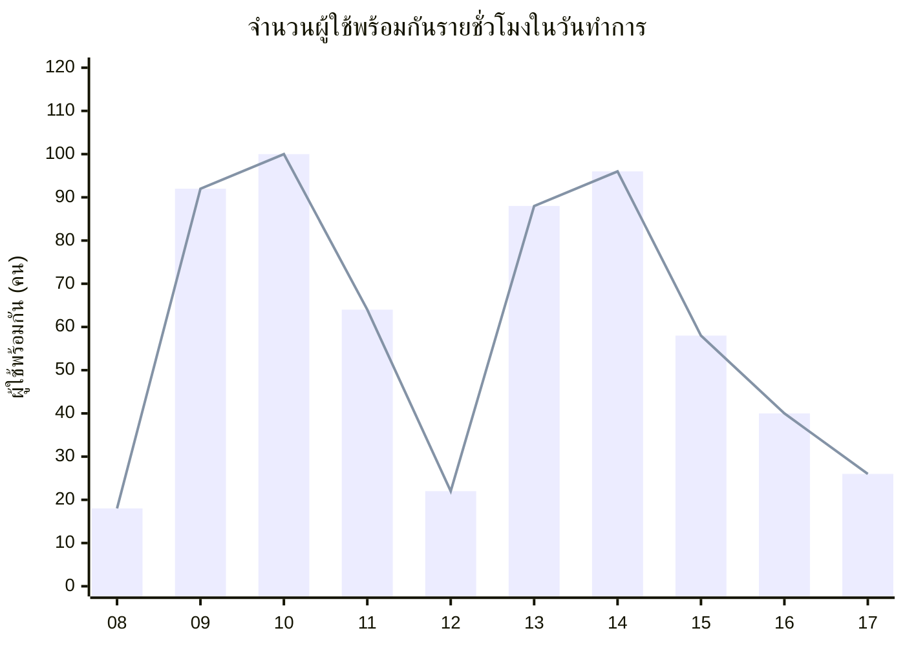

# บทที่ 4 ความต้องการที่ไม่ใช่เชิงหน้าที่

ทุกข้อกำหนดในบทนี้ต้องชี้ผ่านหรือไม่ผ่านได้ด้วยการวัด ตัวเลขที่อ้างอิงสมมติฐานมีรหัส ASM กำกับไว้ในคอลัมน์ที่มา และต้องทบทวนใหม่ทั้งหมดหากสมมติฐานนั้นเปลี่ยน

| หมวด | รหัส | จำนวน |
|---|---|---|
| ประสิทธิภาพ | `NFR-PERF-01` ถึง `NFR-PERF-06` | 6 |
| ความมั่นคงปลอดภัย | `NFR-SEC-01` ถึง `NFR-SEC-06` | 6 |
| ความพร้อมใช้งาน | `NFR-AVL-01` ถึง `NFR-AVL-06` | 6 |
| การใช้งาน | `NFR-USE-01` ถึง `NFR-USE-06` | 6 |
| การคุ้มครองข้อมูลส่วนบุคคล | `NFR-PDPA-01` ถึง `NFR-PDPA-07` | 7 |
| การบำรุงรักษาและการย้ายระบบ | `NFR-MNT-01` ถึง `NFR-MNT-05` | 5 |
| **รวม** | | **36** |

## 4.1 ประสิทธิภาพ (Performance)

| รหัส | ข้อกำหนด | ตัววัด | เกณฑ์ยอมรับ | วิธีทดสอบ | ที่มา |
|---|---|---|---|---|---|
| `NFR-PERF-01` | การค้นหา Room ที่ว่างต้องตอบสนองภายในเวลาที่กำหนด | เวลาตั้งแต่กดค้นหาจนแสดงผล วัดที่เปอร์เซ็นไทล์ที่ 95 | ไม่เกิน 2.0 วินาที ขณะมีผู้ใช้พร้อมกัน 100 คน | ทดสอบภาระงานด้วยสคริปต์จำลองผู้ใช้พร้อมกัน 100 คน ต่อเนื่อง 10 นาที วัดที่ฝั่งเบราว์เซอร์ | ASM-04 |
| `NFR-PERF-02` | การสร้าง Booking ต้องตอบสนองภายในเวลาที่กำหนด | เวลาตั้งแต่กดยืนยันจนได้ผลลัพธ์ วัดที่เปอร์เซ็นไทล์ที่ 95 | ไม่เกิน 3.0 วินาที ขณะมีผู้ใช้พร้อมกัน 100 คน | ทดสอบภาระงานชุดเดียวกับ `NFR-PERF-01` | ASM-04 |
| `NFR-PERF-03` | หน้าปฏิทินรายวันต้องแสดงผลภายในเวลาที่กำหนด | เวลาโหลดหน้าปฏิทินของวันที่มี Booking 200 รายการ วัดที่เปอร์เซ็นไทล์ที่ 95 | ไม่เกิน 2.5 วินาที | สร้างชุดข้อมูลจำลอง 200 Booking ในวันเดียว แล้ววัดเวลาโหลด 50 ครั้ง | ASM-03 |
| `NFR-PERF-04` | ระบบต้องรองรับผู้ใช้พร้อมกันตามจำนวนที่กำหนด | จำนวนผู้ใช้พร้อมกันสูงสุดที่ยังผ่านเกณฑ์ `NFR-PERF-01` | ไม่น้อยกว่า 100 คน | เพิ่มผู้ใช้จำลองครั้งละ 20 คน จนเวลาตอบสนองเกิน 2.0 วินาที บันทึกจำนวนสุดท้ายที่ยังผ่าน | ASM-04 |
| `NFR-PERF-05` | ระบบต้องรองรับปริมาณการเขียนข้อมูลต่อวันทำการ | จำนวนการสร้าง แก้ไข และยกเลิก Booking ที่บันทึกสำเร็จต่อวันทำการ | ไม่น้อยกว่า 200 รายการต่อวัน โดยไม่มีรายการใดล้มเหลวจากข้อผิดพลาดฐานข้อมูล | เขียนข้อมูลต่อเนื่อง 200 รายการภายใน 1 ชั่วโมง ตรวจนับรายการที่ล้มเหลว | ASM-03, CON-04 |
| `NFR-PERF-06` | การสร้าง Booking พร้อมกันไปยัง Room และช่วงเวลาเดียวกันต้องสำเร็จเพียงรายการเดียว | ผลลัพธ์ของคำขอ 10 รายการที่ส่งพร้อมกันไปยัง Room และช่วงเวลาเดียวกัน | สำเร็จ 1 รายการ ถูกปฏิเสธด้วยเหตุผล Conflict 9 รายการ และล้มเหลวด้วยข้อผิดพลาดฐานข้อมูล 0 รายการ | ยิงคำขอพร้อมกัน 10 คำขอ ทำซ้ำ 20 รอบ ตรวจผลลัพธ์ทุกรอบ | CON-04, `FR-BKG-07` |

`NFR-PERF-06` เป็นข้อกำหนดที่ตรวจสอบข้อจำกัด CON-04 โดยตรง เนื่องจากฐานข้อมูลที่เลือกใช้รองรับการเขียนพร้อมกันได้จำกัด (ที่มา: ADR-0003) การจองพร้อมกันไปยังห้องเดียวกันจึงต้องจบลงด้วยการปฏิเสธที่ถูกต้องตามกฎ Conflict ไม่ใช่ด้วยข้อผิดพลาดของฐานข้อมูล

**ภาพที่ 4-1 จำนวนผู้ใช้พร้อมกันรายชั่วโมง** — ภาระงานมีสองยอดคือ 09:00–10:00 และ 13:00–14:00 ซึ่งเป็นช่วงก่อนเริ่มประชุมรอบเช้าและรอบบ่าย ยอดสูงสุด 100 คนที่ 10:00 คือตัวเลขที่ `NFR-PERF-01`, `NFR-PERF-02` และ `NFR-PERF-04` ใช้เป็นเกณฑ์ ตัวเลขทั้งชุดมาจากสมมติฐาน ASM-04 ซึ่งยังต้องยืนยัน `[ต้องยืนยัน — ASM-04]` หากจำนวนพนักงานจริงต่างจาก ASM-03 มาก เกณฑ์ทั้งหมดในหัวข้อ 4.1 ต้องคำนวณใหม่

## 4.2 ความมั่นคงปลอดภัย (Security)

| รหัส | ข้อกำหนด | ตัววัด | เกณฑ์ยอมรับ | วิธีทดสอบ | ที่มา |
|---|---|---|---|---|---|
| `NFR-SEC-01` | ระบบต้องเข้าถึงได้เฉพาะจากภายในเครือข่ายองค์กร | จำนวนช่องทางที่เข้าถึงระบบได้จากภายนอกเครือข่ายองค์กร | เป็น 0 ช่องทาง | สแกนพอร์ตจากเครือข่ายภายนอก ตรวจว่าไม่มีพอร์ตของระบบตอบสนอง | ASM-09, ADR-0002 |
| `NFR-SEC-02` | การรับส่งข้อมูลต้องเข้ารหัส | สัดส่วนคำขอที่ใช้ HTTPS | 100% ของคำขอ และคำขอผ่าน HTTP ต้องถูกเปลี่ยนเส้นทางไป HTTPS ทุกครั้ง | ตรวจด้วยเครื่องมือวิเคราะห์ทราฟฟิกตลอดเส้นทาง UC-01 ถึง UC-05 | CON-06 |
| `NFR-SEC-03` | ระบบต้องจำกัดอัตราการส่งคำขอสร้าง Booking | จำนวนคำขอสร้าง Booking ต่อหมายเลข IP ต่อนาที | เกิน 30 คำขอต่อนาทีต้องได้รับการตอบกลับรหัส 429 | ส่งคำขอ 60 ครั้งภายใน 1 นาที ตรวจว่าคำขอที่ 31 เป็นต้นไปได้รหัส 429 | CON-02 |
| `NFR-SEC-04` | ความเสี่ยงจากการไม่มีการยืนยันตัวตนต้องได้รับการรับทราบเป็นลายลักษณ์อักษรก่อนใช้งานจริง | จำนวนเอกสารรับทราบความเสี่ยงที่ผู้ว่าจ้างลงนาม | ต้องมี 1 ฉบับก่อนติดตั้งใช้งานจริง ระบุชัดว่าผู้ใช้คนใดก็สวมชื่อ Employee ผู้อื่นเพื่อแก้ไขหรือยกเลิก Booking ของคนนั้นได้ | ตรวจเอกสารในชุดส่งมอบ | ADR-0002, CON-02, CON-03 |
| `NFR-SEC-05` | ระบบต้องบันทึกร่องรอยการเปลี่ยนแปลง Booking ทุกครั้ง | สัดส่วนการสร้าง แก้ไข และยกเลิก Booking ที่มีบันทึกร่องรอย | 100% โดยแต่ละบันทึกมีเวลา ชื่อ Employee ที่ผู้ใช้ระบุ รหัส Room และประเภทการกระทำ | สุ่มตรวจ 20 รายการจากบันทึก เทียบกับข้อมูล Booking จริง | ADR-0002 |
| `NFR-SEC-06` | ระบบต้องไม่มีช่องโหว่การแทรกคำสั่งฐานข้อมูล | จำนวนช่องโหว่ SQL injection ที่ตรวจพบ | เป็น 0 ช่อง | ทดสอบด้วยชุดทดสอบการแทรกคำสั่งมาตรฐานกับทุก endpoint ในหัวข้อ 6.3 | CON-04 |

**ข้อควรทราบเกี่ยวกับความเสี่ยงที่ยอมรับไว้แล้ว** — ระบบไม่มีการยืนยันตัวตน การบังคับ Ownership จึงอ้างอิงชื่อที่ผู้ใช้เลือกเอง ไม่ใช่ session ที่ผ่านการยืนยัน (ที่มา: ADR-0002, CON-03) ผลที่ตามมาคือผู้ที่เข้าถึงระบบได้สามารถเลือกชื่อ Employee ผู้อื่นเพื่อยกเลิกหรือแก้ไข Booking ของคนนั้นได้ ระบบนี้จึงเหมาะกับการใช้งานภายในเครือข่ายองค์กรที่ควบคุมการเข้าถึงทางกายภาพและทางเครือข่ายได้เท่านั้น **เงื่อนไขก่อนเปิดใช้งานนอกเครือข่ายองค์กร คือต้องเพิ่มระบบยืนยันตัวตนก่อน ซึ่งจะกระทบเส้นทางการสร้าง Booking ทั้งหมดใน UC-02 ถึง UC-05**

## 4.3 ความพร้อมใช้งาน (Availability)

| รหัส | ข้อกำหนด | ตัววัด | เกณฑ์ยอมรับ | วิธีทดสอบ | ที่มา |
|---|---|---|---|---|---|
| `NFR-AVL-01` | ระบบต้องพร้อมใช้งานในเวลาทำการตามระดับที่กำหนด | สัดส่วนเวลาที่ระบบตอบสนองได้ ในช่วง 08:00–18:00 วันจันทร์ถึงศุกร์ | ไม่น้อยกว่า 99.0% ต่อเดือน คิดเป็นเวลาหยุดสะสมไม่เกิน 132 นาทีต่อเดือน | เก็บสถิติจากระบบเฝ้าระวังที่เรียกทุก 1 นาที สรุปรายเดือน | ASM-10 |
| `NFR-AVL-02` | การหยุดบำรุงรักษาตามแผนต้องอยู่นอกเวลาทำการ | ช่วงเวลาที่หยุดให้บริการตามแผน และระยะเวลาแจ้งล่วงหน้า | หยุดได้เฉพาะนอกช่วง 08:00–18:00 วันจันทร์ถึงศุกร์ และแจ้งล่วงหน้าไม่น้อยกว่า 3 วันทำการ | ตรวจบันทึกการแจ้งเตือนและบันทึกการหยุดระบบย้อนหลัง 6 เดือน | ASM-10 |
| `NFR-AVL-03` | ระบบต้องสำรองข้อมูลตามความถี่ที่กำหนด | ความถี่การสำรองไฟล์ฐานข้อมูล และจำนวนชุดที่เก็บย้อนหลัง | อย่างน้อยวันละ 1 ครั้งนอกเวลาทำการ และเก็บย้อนหลังไม่น้อยกว่า 30 ชุด | ตรวจรายการไฟล์สำรอง 30 วันย้อนหลัง นับจำนวนชุดและตรวจเวลาที่สร้าง | CON-04, ADR-0003 |
| `NFR-AVL-04` | ปริมาณข้อมูลสูงสุดที่ยอมให้สูญหาย (RPO) | ช่วงเวลาระหว่างการสำรองสองครั้งติดกัน | ไม่เกิน 24 ชั่วโมง | กู้คืนจากไฟล์สำรองล่าสุดในสภาพแวดล้อมทดสอบ ตรวจว่าข้อมูลที่หายไปย้อนหลังไม่เกิน 24 ชั่วโมง | ASM-10 |
| `NFR-AVL-05` | เวลาสูงสุดในการกู้คืนระบบ (RTO) | เวลาตั้งแต่ระบบหยุดจนกลับมาให้บริการได้ | ไม่เกิน 4 ชั่วโมง | ซ้อมกู้คืนเต็มรูปแบบปีละ 1 ครั้ง จับเวลาตั้งแต่เริ่มจนระบบตอบสนอง | ASM-10 |
| `NFR-AVL-06` | การซ้อมกู้คืนต้องสำเร็จทุกครั้ง | สัดส่วนการซ้อมกู้คืนที่ได้ข้อมูลครบและระบบทำงานได้ | 100% ของการซ้อม | บันทึกผลการซ้อมทุกครั้ง พร้อมตรวจจำนวน Booking ที่กู้คืนได้เทียบกับก่อนซ้อม | CON-05 |

## 4.4 การใช้งาน (Usability)

| รหัส | ข้อกำหนด | ตัววัด | เกณฑ์ยอมรับ | วิธีทดสอบ | ที่มา |
|---|---|---|---|---|---|
| `NFR-USE-01` | เส้นทางการจองต้องสั้นตามที่กำหนด | จำนวนหน้าจอตั้งแต่หน้าแรกจนจองสำเร็จ | ไม่เกิน 3 หน้าจอ | เดินเส้นทาง UC-02 บนระบบจริง นับจำนวนหน้าจอ | UC-02 |
| `NFR-USE-02` | ข้อความบนหน้าจอทั้งหมดต้องเป็นภาษาไทย | สัดส่วนข้อความที่ผู้ใช้เห็นซึ่งเป็นภาษาไทย | 100% รวมถึงข้อความแจ้งข้อผิดพลาดและข้อความยืนยัน ยกเว้นศัพท์เทคนิคที่นิยามไว้ในหัวข้อ 1.3 | ตรวจทุกหน้าจอในหัวข้อ 6.1 และทุกข้อความข้อยกเว้นในบทที่ 3 | REF-01 |
| `NFR-USE-03` | ข้อความปฏิเสธต้องระบุกฎที่ไม่ผ่านและวิธีแก้ไข | สัดส่วนข้อยกเว้นที่มีข้อความระบุทั้งกฎที่ไม่ผ่านและสิ่งที่ผู้ใช้ต้องแก้ | 100% ของข้อยกเว้น E1 ถึง E7 ของ UC-02 และ E1 ถึง E3 ของ UC-03 และ UC-04 | ทดสอบทีละข้อยกเว้น เทียบข้อความที่ได้กับตาราง Use Case Description | `FR-BKG-10` |
| `NFR-USE-04` | ระบบต้องใช้งานได้บนหน้าจอขนาดเล็ก | ความกว้างหน้าจอต่ำสุดที่ใช้งานได้โดยไม่ต้องเลื่อนแนวนอน | 360 พิกเซล | ทดสอบทุกหน้าจอในหัวข้อ 6.1 ที่ความกว้าง 360, 768 และ 1280 พิกเซล | ASM-09 |
| `NFR-USE-05` | ผู้ใช้ครั้งแรกต้องจองสำเร็จได้ด้วยตนเอง | สัดส่วนผู้ทดสอบที่จองห้องสำเร็จในครั้งแรกโดยไม่ต้องสอบถามผู้อื่น | ไม่น้อยกว่า 8 ใน 10 คน | ทดสอบการใช้งานกับพนักงาน 10 คนที่ไม่เคยใช้ระบบ กำหนดโจทย์เดียวกันทุกคน | UC-02 |
| `NFR-USE-06` | ตัวอักษรต้องมีความต่างของสีตามเกณฑ์ที่กำหนด | อัตราส่วนความต่างของสีระหว่างตัวอักษรกับพื้นหลัง | ไม่น้อยกว่า 4.5 ต่อ 1 สำหรับข้อความขนาดปกติ และ 3 ต่อ 1 สำหรับข้อความขนาดใหญ่ | ตรวจด้วยเครื่องมือตรวจการเข้าถึงตามมาตรฐาน WCAG 2.1 ระดับ AA ทุกหน้าจอ | — |

## 4.5 การคุ้มครองข้อมูลส่วนบุคคล (PDPA)

ข้อกำหนดในหัวข้อนี้อ้างอิงข้อมูลส่วนบุคคลที่ระบุไว้ในคอลัมน์ "ข้อมูลส่วนบุคคล" ของตาราง Data Dictionary หัวข้อ 5.2 หากมีการเพิ่มฟิลด์ข้อมูลส่วนบุคคลในภายหลัง ต้องทบทวนทุกข้อในหัวข้อนี้

| รหัส | ข้อกำหนด | ตัววัด | เกณฑ์ยอมรับ | วิธีทดสอบ | ที่มา |
|---|---|---|---|---|---|
| `NFR-PDPA-01` | ระบบต้องเก็บข้อมูลส่วนบุคคลเท่าที่จำเป็นต่อการจองห้อง | จำนวนและรายการฟิลด์ข้อมูลส่วนบุคคลที่จัดเก็บ | เก็บเฉพาะชื่อ นามสกุล และหน่วยงาน ตามที่ระบุในหัวข้อ 5.2 และไม่เก็บเลขประจำตัวประชาชน หมายเลขโทรศัพท์ หรืออีเมล | ตรวจโครงสร้างฐานข้อมูลจริงเทียบกับตารางหัวข้อ 5.2 ทีละฟิลด์ | REF-06 |
| `NFR-PDPA-02` | ระบบต้องแจ้งวัตถุประสงค์การเก็บข้อมูลก่อนบันทึก | สัดส่วนครั้งที่เข้าหน้าจอ `SC-03` แล้วเห็นข้อความแจ้งวัตถุประสงค์ก่อนปุ่มยืนยัน | 100% ของครั้งที่เข้าหน้าจอ และเข้าถึงข้อความเต็มได้ภายใน 1 คลิกจากหน้าจอเดียวกัน | เข้าหน้าจอ `SC-03` ผ่านทุกเส้นทางที่นำไปสู่การสร้าง Booking ตรวจการปรากฏของข้อความทุกครั้ง | REF-06 |
| `NFR-PDPA-03` | Employee ต้องเข้าถึงข้อมูล Booking ของตนได้ | จำนวนหน้าจอจากหน้าแรกจนเห็นรายการ Booking ของตนครบทุกรายการ | ไม่เกิน 2 หน้าจอ ผ่านเส้นทาง UC-05 | เดินเส้นทาง UC-05 นับจำนวนหน้าจอ และตรวจว่ารายการครบเทียบกับฐานข้อมูล | REF-06, UC-05 |
| `NFR-PDPA-04` | ต้องมีช่องทางแก้ไขข้อมูลที่ไม่ถูกต้อง | การมีอยู่ของช่องทางแก้ไขสำหรับข้อมูล Booking และสำหรับชื่อและหน่วยงาน | ข้อมูล Booking แก้ไขได้เองผ่าน UC-03 และชื่อกับหน่วยงานแก้ไขได้ผ่านผู้ดูแลข้อมูลตาม UC-08 ภายใน 7 วันทำการนับจากรับคำขอ | เดินเส้นทาง UC-03 และซ้อมคำขอแก้ไขชื่อหนึ่งรายการ จับเวลาดำเนินการ | REF-06 |
| `NFR-PDPA-05` | ต้องดำเนินการตามคำขอลบข้อมูลส่วนบุคคลภายในเวลาที่กำหนด | ระยะเวลาตั้งแต่รับคำขอจนลบข้อมูลเสร็จ | ไม่เกิน 30 วันนับจากวันที่รับคำขอ | ซ้อมดำเนินการตามคำขอตัวอย่างหนึ่งรายการ จับเวลาและตรวจว่าข้อมูลถูกลบจริง | REF-06 |
| `NFR-PDPA-06` | ข้อมูลส่วนบุคคลต้องถูกลบเมื่อพ้นระยะเวลาเก็บรักษา | อายุสูงสุดของ Booking ที่ยังคงเชื่อมโยงกับชื่อ Employee | 2 ปีนับจากเวลาสิ้นสุดของ Booking `[ต้องยืนยัน — ASM-08]` | ตรวจว่ามีงานตามกำหนดเวลาที่ทำงานจริง และตรวจฐานข้อมูลว่าไม่มี Booking อายุเกิน 2 ปีที่ยังผูกกับชื่อ | ASM-08, REF-06 |
| `NFR-PDPA-07` | รายงานสถิติต้องไม่ระบุตัวบุคคล | สัดส่วนรายงานอัตราการใช้ Room ที่ไม่ปรากฏชื่อ Employee | 100% ของรายงานทุกรูปแบบ | เรียกรายงานทุกรูปแบบและตรวจผลลัพธ์ว่าไม่มีชื่อหรือรหัส Employee ปรากฏ | REF-06 |

## 4.6 การบำรุงรักษาและการย้ายระบบ (Maintainability และ Portability)

| รหัส | ข้อกำหนด | ตัววัด | เกณฑ์ยอมรับ | วิธีทดสอบ | ที่มา |
|---|---|---|---|---|---|
| `NFR-MNT-01` | ระบบต้องติดตั้งได้ด้วยขั้นตอนจำนวนน้อย | จำนวนคำสั่งที่ต้องพิมพ์เพื่อติดตั้งระบบทั้งชุดบนเครื่องใหม่ | ไม่เกิน 1 คำสั่ง ผ่าน docker compose | ติดตั้งบนเครื่องที่ยังไม่เคยติดตั้ง นับจำนวนคำสั่งจนระบบให้บริการได้ | ADR-0003, ADR-0004 |
| `NFR-MNT-02` | การย้ายข้อมูลไปเครื่องใหม่ต้องทำได้ด้วยการคัดลอกไฟล์ | จำนวนไฟล์ที่ต้องคัดลอกเพื่อย้ายข้อมูลทั้งหมด | 1 ไฟล์ และระบบต้องทำงานได้ทันทีหลังคัดลอก | คัดลอกไฟล์ฐานข้อมูลไปเครื่องใหม่ ตรวจว่าจำนวน Booking และ Room ครบเท่าเดิม | ADR-0003 |
| `NFR-MNT-03` | Frontend ต้องไม่เข้าถึงฐานข้อมูลโดยตรง | จำนวนจุดใน Frontend ที่เรียกฐานข้อมูลหรือ ORM โดยตรง | เป็น 0 จุด ทุกการเข้าถึงข้อมูลต้องผ่าน REST API ที่ระบุในหัวข้อ 6.3 | ค้นหาการอ้างถึง Prisma และการเชื่อมต่อฐานข้อมูลในซอร์สโค้ดฝั่ง Frontend ทั้งหมด | ADR-0004, CON-07 |
| `NFR-MNT-04` | ระบบต้องทำงานได้บนเบราว์เซอร์ที่กำหนด | จำนวนชุดเบราว์เซอร์และเวอร์ชันที่เดินเส้นทาง UC-01 ถึง UC-05 ได้ครบโดยไม่มีข้อผิดพลาด | ครบ 8 ชุด คือ Chrome, Edge, Firefox และ Safari อย่างละ 2 เวอร์ชันหลักล่าสุด | เดินเส้นทาง UC-01 ถึง UC-05 ให้ครบทั้ง 8 ชุด บันทึกผลรายชุด | CON-06 |
| `NFR-MNT-05` | ต้องมีเอกสารเส้นทางการย้ายฐานข้อมูลเมื่อระบบขยายตัว | จำนวนเอกสารระบุขั้นตอนย้ายจาก SQLite ไป Postgres และจำนวนจุดใน ADR-0003 ที่เอกสารครอบคลุม | ต้องมี 1 ฉบับในชุดส่งมอบ และครอบคลุมครบ 100% ของจุดที่ ADR-0003 ระบุว่าต้องแก้ไข | ตรวจเอกสารในชุดส่งมอบ แล้วไล่ทีละจุดที่ ADR-0003 ระบุ | ADR-0003, CON-05 |

---

[← บทที่ 3 ความต้องการเชิงหน้าที่](03-functional-requirements.md) · [สารบัญ](README.md) · [บทที่ 5 ความต้องการด้านข้อมูล →](05-data-requirements.md)
