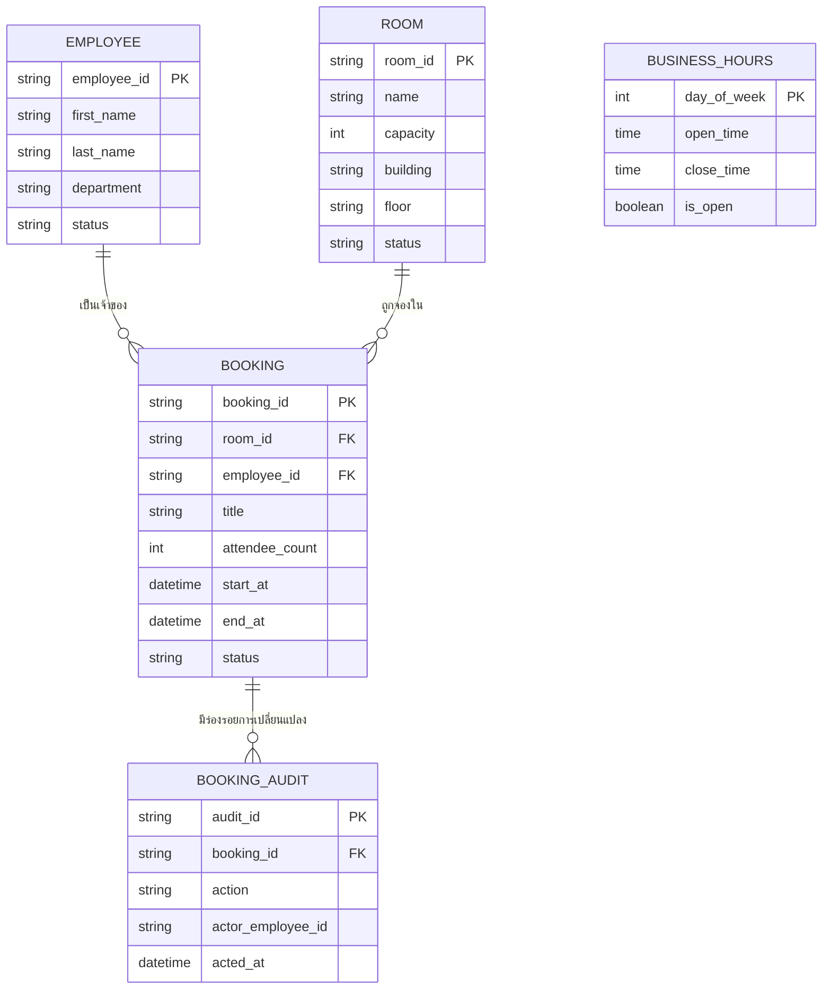

# บทที่ 5 ความต้องการด้านข้อมูล

## 5.1 ข้อมูลหลัก

ข้อมูลในระบบมีห้าหน่วย สามหน่วยแรกมาจากคำศัพท์ใน `CONTEXT.md` โดยตรง อีกสองหน่วยเกิดจากข้อกำหนดในบทที่ 4

- **ROOM** — ห้องประชุมทางกายภาพ หนึ่งแถวต่อหนึ่งห้อง ถือ Capacity และที่ตั้ง
- **EMPLOYEE** — รายการพนักงานที่ใช้ระบุเจ้าของ Booking เป็นข้อมูลที่ผู้ดูแลข้อมูลเตรียมไว้ล่วงหน้า ไม่มีรหัสผ่านหรือข้อมูลการยืนยันตัวตนใด (ที่มา: ADR-0002)
- **BOOKING** — การจองหนึ่งครั้ง ผูกกับ ROOM หนึ่งแถวและ EMPLOYEE หนึ่งแถวเสมอ (CON-09) ถือช่วงเวลา หัวข้อการประชุม จำนวนผู้เข้าร่วม และสถานะตามภาพที่ 3-6
- **BUSINESS_HOURS** — ค่าตั้งค่าช่วงเวลาทำการรายวันในสัปดาห์ แยกออกจากโค้ดเพื่อให้ผู้ดูแลข้อมูลแก้ไขได้ `[ต้องยืนยัน — ASM-02]`
- **BOOKING_AUDIT** — บันทึกร่องรอยการสร้าง แก้ไข และยกเลิก Booking ตามที่ `NFR-SEC-05` กำหนด

ระบบไม่มีหน่วยข้อมูลที่แทนองค์กรหรือหน่วยงานเจ้าของข้อมูล เพราะออกแบบสำหรับองค์กรเดียว (ที่มา: ADR-0001, CON-01)

**ภาพที่ 5-1 Conceptual ERD** — ความสัมพันธ์ทั้งหมดเป็นแบบหนึ่งต่อกลุ่ม BOOKING เป็นหน่วยกลางที่เชื่อม ROOM กับ EMPLOYEE เข้าด้วยกัน และเป็นหน่วยเดียวที่มีสถานะเปลี่ยนแปลงตามเวลา BUSINESS_HOURS ไม่มีความสัมพันธ์กับหน่วยใด เพราะเป็นค่าตั้งค่าระดับระบบที่ใช้ตรวจ BOOKING ทุกแถวเหมือนกัน กฎ Conflict ไม่ปรากฏเป็นความสัมพันธ์ในภาพนี้ เพราะเป็นเงื่อนไขระหว่างแถวของ BOOKING ด้วยกันเองภายใต้ room_id เดียวกัน

## 5.2 ตารางความต้องการด้านข้อมูล

| รหัส | ข้อกำหนด | ความสำคัญ | ที่มา |
|---|---|---|---|
| `DR-01` | ระบบต้องจัดเก็บข้อมูล Room ได้แก่ ชื่อห้อง Capacity อาคาร ชั้น และสถานะการเปิดใช้งาน | บังคับ | REF-01 |
| `DR-02` | ระบบต้องจัดเก็บข้อมูล Employee ได้แก่ ชื่อ นามสกุล หน่วยงาน และสถานะการเปิดใช้งาน โดยไม่จัดเก็บข้อมูลการยืนยันตัวตนใด | บังคับ | REF-01, ADR-0002 |
| `DR-03` | ระบบต้องจัดเก็บข้อมูล Booking ได้แก่ Room เจ้าของ ช่วงเวลาเริ่มและสิ้นสุด หัวข้อการประชุม จำนวนผู้เข้าร่วม และสถานะ | บังคับ | REF-01 |
| `DR-04` | Booking หนึ่งแถวต้องอ้างถึง Room หนึ่งแถวและ Employee หนึ่งแถวเสมอ และระบบต้องปฏิเสธการบันทึกที่ขาดอย่างใดอย่างหนึ่ง | บังคับ | CON-09 |
| `DR-05` | ระบบต้องจัดเก็บค่า Business Hours เป็นข้อมูลตั้งค่ารายวันในสัปดาห์ที่แก้ไขได้โดยไม่ต้องแก้โปรแกรม `[ต้องยืนยัน — ASM-02]` | ควรมี | ASM-02, REF-01 |
| `DR-06` | ระบบต้องจัดเก็บบันทึกร่องรอยการสร้าง แก้ไข และยกเลิก Booking พร้อมเวลาและชื่อ Employee ที่ผู้ใช้ระบุ | บังคับ | `NFR-SEC-05` |
| `DR-07` | ระบบต้องจัดเก็บและตีความค่าเวลาทั้งหมดในเขตเวลา Asia/Bangkok เพียงเขตเดียว `[ต้องยืนยัน — ASM-05]` | บังคับ | ASM-05 |
| `DR-08` | ระบบต้องไม่ลบแถว Booking ออกจากฐานข้อมูลเมื่อผู้ใช้ยกเลิก แต่ต้องเปลี่ยนสถานะเป็นยกเลิกแล้ว เพื่อคงประวัติการใช้ห้อง | บังคับ | `FR-BKG-16` |
| `DR-09` | ระบบต้องคงความสัมพันธ์ของ Booking เดิมไว้ครบถ้วน เมื่อ Room หรือ Employee ที่เกี่ยวข้องถูกปิดการใช้งาน | บังคับ | `FR-ROOM-05`, `FR-EMP-05` |
| `DR-10` | ระบบต้องรองรับปริมาณข้อมูลตามประมาณการ 3 ปีในหัวข้อ 5.3 โดยยังผ่านเกณฑ์ `NFR-PERF-03` | บังคับ | ASM-03 |
| `DR-11` | ระบบต้องลบหรือทำให้ข้อมูลส่วนบุคคลไม่ระบุตัวตน เมื่อพ้นระยะเวลาเก็บรักษาตามหัวข้อ 5.4 | บังคับ | `NFR-PDPA-06`, REF-06 |
| `DR-12` | ข้อมูลทั้งหมดของระบบต้องอยู่ในไฟล์ฐานข้อมูลไฟล์เดียวที่สำรองได้ด้วยการคัดลอกไฟล์ | บังคับ | ADR-0003, `NFR-MNT-02` |

## 5.3 Data Dictionary เบื้องต้น

คอลัมน์ **ข้อมูลส่วนบุคคล** เป็นตัวป้อนให้ข้อกำหนดในหัวข้อ 4.5 ทุกแถวที่เป็น "ใช่" ต้องอยู่ในขอบเขตของ `NFR-PDPA-01`, `NFR-PDPA-06` และ `NFR-PDPA-07`

### ROOM

| Attribute | ชื่อภาษาไทย | ชนิดข้อมูล | บังคับ | คีย์ | กฎการตรวจสอบ | ข้อมูลส่วนบุคคล |
|---|---|---|---|---|---|---|
| `room_id` | รหัสห้องประชุม | string(36) | ใช่ | PK | ค่าไม่ซ้ำ สร้างโดยระบบ | ไม่ใช่ |
| `name` | ชื่อห้องประชุม | string(100) | ใช่ | — | ความยาว 1–100 ตัวอักษร และไม่ซ้ำกับห้องอื่น | ไม่ใช่ |
| `capacity` | ความจุ | int | ใช่ | — | จำนวนเต็มตั้งแต่ 1 ถึง 500 และห้ามน้อยกว่าจำนวนผู้เข้าร่วมสูงสุดของ Booking ที่ยังไม่ผ่าน (`FR-ROOM-07`) | ไม่ใช่ |
| `building` | อาคาร | string(100) | ใช่ | — | ความยาว 1–100 ตัวอักษร | ไม่ใช่ |
| `floor` | ชั้น | string(20) | ใช่ | — | ความยาว 1–20 ตัวอักษร | ไม่ใช่ |
| `status` | สถานะการเปิดใช้งาน | string(20) | ใช่ | — | ค่าใดค่าหนึ่งใน เปิดใช้งาน หรือ ปิดการใช้งานชั่วคราว ตามภาพที่ 3-2 | ไม่ใช่ |
| `created_at` | เวลาที่สร้าง | datetime | ใช่ | — | ระบบกำหนด เขตเวลา Asia/Bangkok | ไม่ใช่ |
| `updated_at` | เวลาที่แก้ไขล่าสุด | datetime | ใช่ | — | ระบบกำหนด | ไม่ใช่ |

### EMPLOYEE

| Attribute | ชื่อภาษาไทย | ชนิดข้อมูล | บังคับ | คีย์ | กฎการตรวจสอบ | ข้อมูลส่วนบุคคล |
|---|---|---|---|---|---|---|
| `employee_id` | รหัสพนักงานในระบบ | string(36) | ใช่ | PK | ค่าไม่ซ้ำ สร้างโดยระบบ ไม่ใช่รหัสพนักงานขององค์กร | ใช่ |
| `first_name` | ชื่อ | string(100) | ใช่ | — | ความยาว 1–100 ตัวอักษร | ใช่ |
| `last_name` | นามสกุล | string(100) | ใช่ | — | ความยาว 1–100 ตัวอักษร | ใช่ |
| `department` | หน่วยงาน | string(100) | ใช่ | — | ความยาว 1–100 ตัวอักษร ใช้ช่วยแยกกรณีชื่อซ้ำ | ใช่ |
| `status` | สถานะการเปิดใช้งาน | string(20) | ใช่ | — | ค่าใดค่าหนึ่งใน เปิดใช้งาน หรือ ปิดการใช้งาน | ไม่ใช่ |
| `created_at` | เวลาที่สร้าง | datetime | ใช่ | — | ระบบกำหนด | ไม่ใช่ |
| `updated_at` | เวลาที่แก้ไขล่าสุด | datetime | ใช่ | — | ระบบกำหนด | ไม่ใช่ |

ระบบไม่จัดเก็บรหัสผ่าน อีเมล หมายเลขโทรศัพท์ หรือเลขประจำตัวประชาชนของ Employee (`NFR-PDPA-01`, ที่มา: ADR-0002)

### BOOKING

| Attribute | ชื่อภาษาไทย | ชนิดข้อมูล | บังคับ | คีย์ | กฎการตรวจสอบ | ข้อมูลส่วนบุคคล |
|---|---|---|---|---|---|---|
| `booking_id` | รหัสการจอง | string(36) | ใช่ | PK | ค่าไม่ซ้ำ สร้างโดยระบบ | ไม่ใช่ |
| `room_id` | รหัสห้องประชุม | string(36) | ใช่ | FK → ROOM | ต้องมีอยู่จริงในตาราง ROOM (`DR-04`) | ไม่ใช่ |
| `employee_id` | รหัสเจ้าของการจอง | string(36) | ใช่ | FK → EMPLOYEE | ต้องมีอยู่จริงในตาราง EMPLOYEE (`DR-04`, `FR-EMP-03`) | ใช่ |
| `title` | หัวข้อการประชุม | string(200) | ใช่ | — | ความยาว 1–200 ตัวอักษร (`FR-BKG-11`) | อาจใช่ — ผู้ใช้พิมพ์ชื่อบุคคลลงในหัวข้อได้ ต้องอยู่ในขอบเขตการลบตาม `NFR-PDPA-06` |
| `attendee_count` | จำนวนผู้เข้าร่วม | int | ใช่ | — | จำนวนเต็มตั้งแต่ 1 และไม่เกิน `capacity` ของ Room ที่อ้างถึง (`FR-BKG-06`) | ไม่ใช่ |
| `start_at` | เวลาเริ่ม | datetime | ใช่ | — | อยู่ใน Business Hours (`FR-BKG-05`) และไม่อยู่ในอดีต ณ เวลาที่บันทึก (`FR-BKG-09`) | ไม่ใช่ |
| `end_at` | เวลาสิ้นสุด | datetime | ใช่ | — | มากกว่า `start_at` (`FR-BKG-08`) และอยู่ใน Business Hours (`FR-BKG-05`) | ไม่ใช่ |
| `status` | สถานะการจอง | string(20) | ใช่ | — | ค่าใดค่าหนึ่งใน ยืนยันแล้ว ยกเลิกแล้ว หรือ เสร็จสิ้น ตามภาพที่ 3-6 | ไม่ใช่ |
| `created_at` | เวลาที่สร้าง | datetime | ใช่ | — | ระบบกำหนด | ไม่ใช่ |
| `updated_at` | เวลาที่แก้ไขล่าสุด | datetime | ใช่ | — | ระบบกำหนด | ไม่ใช่ |

**กฎระดับตาราง** — ห้ามมี BOOKING สองแถวที่มี `room_id` เดียวกัน สถานะยืนยันแล้วทั้งคู่ และช่วงเวลา `start_at` ถึง `end_at` ซ้อนทับกัน (`FR-BKG-07`) กฎนี้ต้องบังคับที่ระดับฐานข้อมูลหรือภายในธุรกรรมเดียวกัน เพื่อให้ผ่านเกณฑ์ `NFR-PERF-06`

### BOOKING_AUDIT

| Attribute | ชื่อภาษาไทย | ชนิดข้อมูล | บังคับ | คีย์ | กฎการตรวจสอบ | ข้อมูลส่วนบุคคล |
|---|---|---|---|---|---|---|
| `audit_id` | รหัสบันทึกร่องรอย | string(36) | ใช่ | PK | ค่าไม่ซ้ำ สร้างโดยระบบ | ไม่ใช่ |
| `booking_id` | รหัสการจองที่เกี่ยวข้อง | string(36) | ใช่ | FK → BOOKING | ต้องมีอยู่จริงในตาราง BOOKING | ไม่ใช่ |
| `action` | ประเภทการกระทำ | string(20) | ใช่ | — | ค่าใดค่าหนึ่งใน สร้าง แก้ไข หรือ ยกเลิก | ไม่ใช่ |
| `actor_employee_id` | รหัส Employee ที่ผู้ใช้ระบุ | string(36) | ใช่ | — | เก็บค่าที่ผู้ใช้เลือก ณ เวลานั้น ไม่ใช่ตัวตนที่ผ่านการยืนยัน (CON-03) | ใช่ |
| `acted_at` | เวลาที่เกิดการกระทำ | datetime | ใช่ | — | ระบบกำหนด | ไม่ใช่ |
| `detail` | รายละเอียดการเปลี่ยนแปลง | string(1000) | ไม่ | — | สรุปฟิลด์ที่เปลี่ยนจากค่าใดเป็นค่าใด | อาจใช่ — หากมีค่าของ `title` อยู่ด้วย |

### BUSINESS_HOURS

| Attribute | ชื่อภาษาไทย | ชนิดข้อมูล | บังคับ | คีย์ | กฎการตรวจสอบ | ข้อมูลส่วนบุคคล |
|---|---|---|---|---|---|---|
| `day_of_week` | วันในสัปดาห์ | int | ใช่ | PK | จำนวนเต็ม 0 ถึง 6 โดย 0 คือวันอาทิตย์ | ไม่ใช่ |
| `open_time` | เวลาเปิด | time | ใช่ | — | ค่าเริ่มต้น 08:00 | ไม่ใช่ |
| `close_time` | เวลาปิด | time | ใช่ | — | ค่าเริ่มต้น 18:00 และต้องมากกว่า `open_time` | ไม่ใช่ |
| `is_open` | เป็นวันทำการหรือไม่ | boolean | ใช่ | — | ค่าเริ่มต้นเป็นจริงสำหรับวันจันทร์ถึงศุกร์ และเป็นเท็จสำหรับวันเสาร์และอาทิตย์ | ไม่ใช่ |

## 5.4 ปริมาณข้อมูลและการเติบโต

ตัวเลขทั้งหมดคำนวณจากสมมติฐาน ASM-03 (Room 20 ห้อง Employee 300 คน) และ ASM-04 (Booking ประมาณ 60 รายการต่อวันทำการ 20 วันทำการต่อเดือน) `[ต้องยืนยัน — ASM-03, ASM-04]`

| Entity | ปริมาณเริ่มต้น | อัตราเพิ่มต่อเดือน | ประมาณการ 3 ปี | ขนาดต่อแถวโดยประมาณ | ขนาดรวม 3 ปี |
|---|---|---|---|---|---|
| ROOM | 20 แถว | 0–1 แถว | ประมาณ 45 แถว | 300 ไบต์ | ต่ำกว่า 1 MB |
| EMPLOYEE | 300 แถว | ประมาณ 5 แถว | ประมาณ 480 แถว | 300 ไบต์ | ต่ำกว่า 1 MB |
| BOOKING | 0 แถว | ประมาณ 1,200 แถว | ประมาณ 43,200 แถว | 500 ไบต์ | ประมาณ 22 MB |
| BOOKING_AUDIT | 0 แถว | ประมาณ 1,800 แถว | ประมาณ 64,800 แถว | 400 ไบต์ | ประมาณ 26 MB |
| BUSINESS_HOURS | 7 แถว | 0 แถว | 7 แถว | 100 ไบต์ | ต่ำกว่า 1 MB |
| **รวม** | | | **ประมาณ 108,500 แถว** | | **ประมาณ 50 MB** |

ปริมาณข้อมูลระดับนี้อยู่ในวิสัยที่ฐานข้อมูลไฟล์เดียวรองรับได้โดยไม่กระทบเกณฑ์ในหัวข้อ 4.1 ข้อจำกัดที่แท้จริงของ CON-04 อยู่ที่จำนวนการเขียนพร้อมกัน ไม่ใช่ปริมาณข้อมูลสะสม จึงต้องเฝ้าระวังผ่าน `NFR-PERF-06` เป็นหลัก

หากปริมาณ Booking จริงเกินประมาณการนี้เกิน 3 เท่า ให้ทบทวนเส้นทางการย้ายฐานข้อมูลตาม `NFR-MNT-05`

## 5.5 การเก็บรักษาและการทำลายข้อมูล

| ประเภทข้อมูล | ระยะเวลาเก็บ | การจัดการเมื่อครบกำหนด | ผู้รับผิดชอบ | ที่มา |
|---|---|---|---|---|
| Booking สถานะเสร็จสิ้นหรือยกเลิกแล้ว | 2 ปีนับจาก `end_at` | ลบค่า `employee_id` และ `title` ออก คงเฉพาะ `room_id` ช่วงเวลา และ `attendee_count` ไว้เพื่อทำสถิติแบบไม่ระบุตัวตน | ผู้ดูแลระบบ | `NFR-PDPA-06`, ASM-08 |
| ข้อมูล Employee ที่ปิดการใช้งานแล้ว | 2 ปีนับจากวันที่ปิดการใช้งาน | ลบแถวออก หลังจากที่ Booking ทุกรายการที่อ้างถึงผ่านการทำให้ไม่ระบุตัวตนแล้ว | ผู้ดูแลข้อมูล | `NFR-PDPA-06` |
| บันทึกร่องรอย BOOKING_AUDIT | 1 ปีนับจาก `acted_at` | ลบแถวออก | ผู้ดูแลระบบ | `NFR-SEC-05` |
| ไฟล์สำรองฐานข้อมูล | 30 ชุดล่าสุด | ลบชุดที่เก่ากว่านั้น | ฝ่ายเทคโนโลยีสารสนเทศ | `NFR-AVL-03` |
| ข้อมูล Room | ตลอดอายุการใช้งานของห้อง | ลบได้เมื่อไม่มี Booking ที่ยังไม่ผ่านอ้างถึง (`FR-ROOM-06`) | ผู้ดูแลข้อมูล | `DR-09` |
| ข้อมูล BUSINESS_HOURS | ตลอดอายุการใช้งานระบบ | ไม่มีการลบ มีเพียงการแก้ไขค่า | ผู้ดูแลข้อมูล | `DR-05` |

**การดำเนินการเมื่อได้รับคำขอลบข้อมูลจากเจ้าของข้อมูล** — ต้องดำเนินการภายใน 30 วันตาม `NFR-PDPA-05` โดยลบค่า `employee_id` และ `title` ของ Booking ทุกรายการของบุคคลนั้น แล้วจึงลบแถว EMPLOYEE ลำดับนี้จำเป็นเพราะ `DR-09` กำหนดให้คงความสัมพันธ์ของ Booking เดิมไว้ครบถ้วน

## 5.6 การสำรองและกู้คืน

| หัวข้อ | ข้อกำหนด | ที่มา |
|---|---|---|
| วิธีสำรอง | คัดลอกไฟล์ฐานข้อมูลทั้งไฟล์ขณะไม่มีธุรกรรมค้าง | `DR-12`, `NFR-MNT-02` |
| ความถี่ | อย่างน้อยวันละ 1 ครั้ง ในช่วงนอกเวลาทำการ | `NFR-AVL-03` |
| ที่เก็บ | เครื่องแม่ข่ายสำรองที่แยกจากเครื่องที่ให้บริการ อยู่ภายในเครือข่ายองค์กร | `NFR-SEC-01` |
| จำนวนชุดที่เก็บ | ไม่น้อยกว่า 30 ชุดย้อนหลัง | `NFR-AVL-03` |
| การทดสอบกู้คืน | ซ้อมกู้คืนเต็มรูปแบบปีละ 1 ครั้ง โดยตรวจนับจำนวน Booking และ Room เทียบกับก่อนซ้อม | `NFR-AVL-05`, `NFR-AVL-06` |
| เกณฑ์ RPO และ RTO | สูญหายไม่เกิน 24 ชั่วโมง และกู้คืนได้ภายใน 4 ชั่วโมง | `NFR-AVL-04`, `NFR-AVL-05` |

---

[← บทที่ 4 ความต้องการที่ไม่ใช่เชิงหน้าที่](04-non-functional-requirements.md) · [สารบัญ](README.md) · [บทที่ 6 ความต้องการด้าน Interface →](06-interface-requirements.md)
