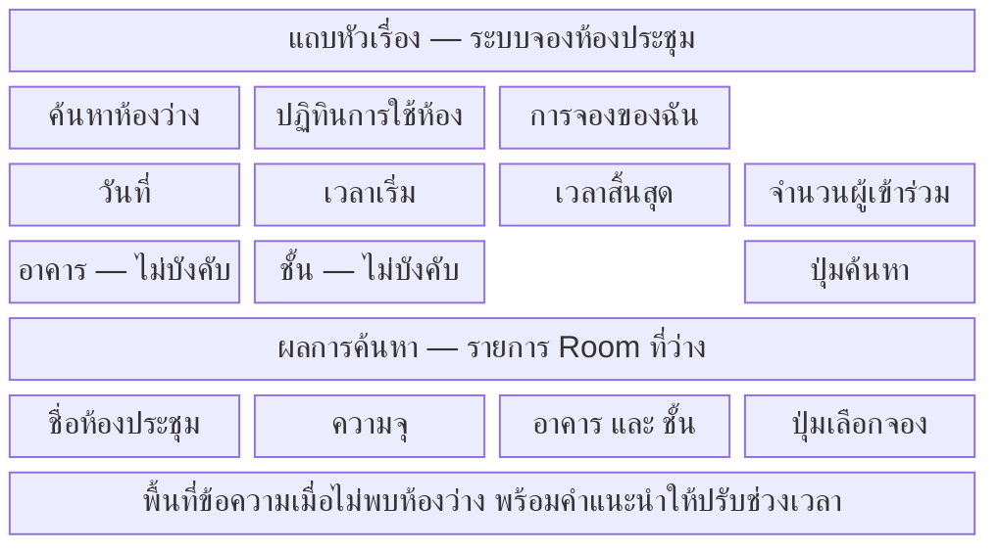
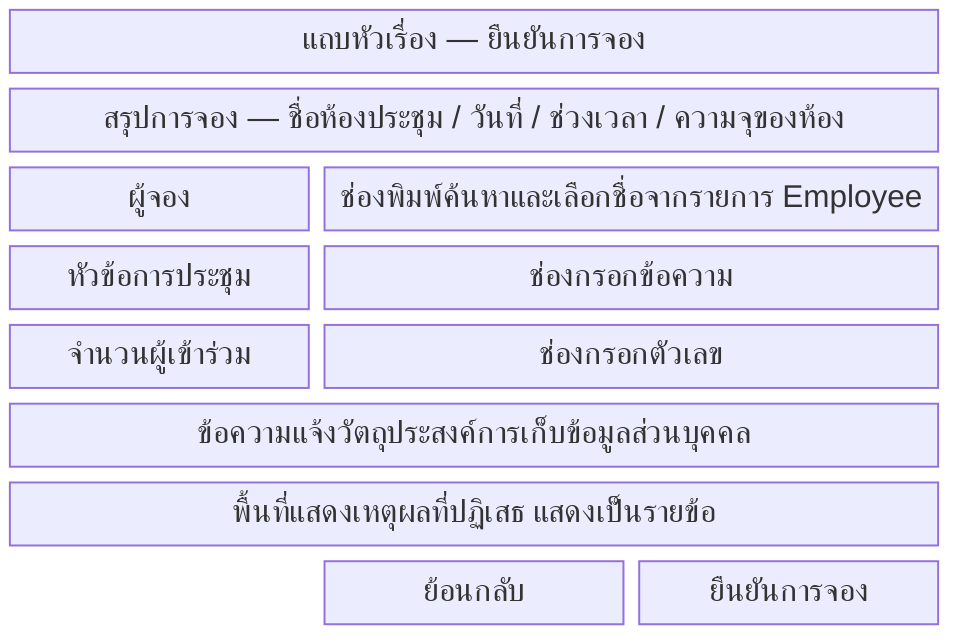
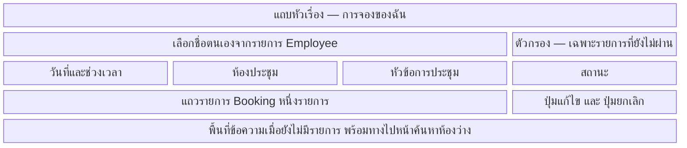
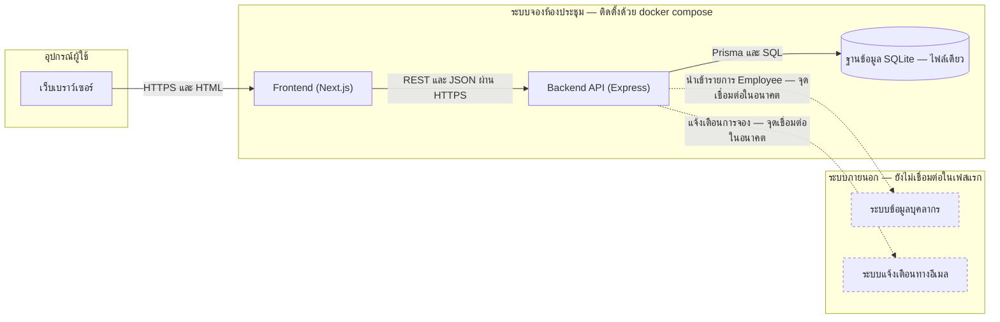

# บทที่ 6 ความต้องการด้าน Interface

## 6.1 ส่วนติดต่อผู้ใช้ (User Interface)

### 6.1.1 รายการหน้าจอ

| รหัสหน้าจอ | ชื่อหน้าจอ | ผู้ใช้ | หน้าที่ | Use Case ที่รองรับ |
|---|---|---|---|---|
| `SC-01` | ค้นหาห้องว่าง | พนักงาน | รับเงื่อนไขการค้นหาและแสดงรายการ Room ที่ว่างในหน้าเดียวกัน | UC-01 |
| `SC-02` | ปฏิทินการใช้งาน Room | พนักงาน, ผู้ดูแลข้อมูล | แสดง Booking ทั้งหมดของวันที่เลือก จัดกลุ่มตาม Room | UC-06 |
| `SC-03` | ยืนยันการจอง | พนักงาน | รับชื่อเจ้าของ หัวข้อการประชุม จำนวนผู้เข้าร่วม และแสดงเหตุผลที่ปฏิเสธ | UC-02 |
| `SC-04` | ผลการจอง | พนักงาน | แสดงรายละเอียด Booking ที่บันทึกสำเร็จ | UC-02 |
| `SC-05` | การจองของฉัน | พนักงาน | แสดงรายการ Booking ของ Employee ที่เลือก | UC-05 |
| `SC-06` | รายละเอียดและแก้ไข Booking | พนักงานเจ้าของ Booking | แสดงรายละเอียดครบทุกฟิลด์และให้แก้ไข | UC-03, UC-05 |
| `SC-07` | ยืนยันการยกเลิก Booking | พนักงานเจ้าของ Booking | แสดงรายละเอียดและขอการยืนยันซ้ำก่อนยกเลิก | UC-04 |
| `SC-08` | จัดการข้อมูล Room | ผู้ดูแลข้อมูล | เพิ่ม แก้ไข ปิดการใช้งาน และลบ Room | UC-07 |
| `SC-09` | จัดการรายการ Employee | ผู้ดูแลข้อมูล | เพิ่ม แก้ไข และปิดการใช้งาน Employee | UC-08 |

เส้นทางการจองที่สั้นที่สุดคือ `SC-01` → `SC-03` → `SC-04` รวมสามหน้าจอ ซึ่งเป็นเกณฑ์ของ `NFR-USE-01` เส้นทางไปยังรายการ Booking ของตนคือ `SC-01` → `SC-05` รวมสองหน้าจอ ตามเกณฑ์ของ `NFR-PDPA-03`

### 6.1.2 Wireframe ระดับหยาบ

Wireframe ในหัวข้อนี้กำหนดเพียงองค์ประกอบที่ต้องมีและตำแหน่งสัมพัทธ์ ไม่กำหนดสี ฟอนต์ หรือระยะห่าง

**ภาพที่ 6-1 Wireframe หน้าจอ `SC-01` ค้นหาห้องว่าง** — ฟอร์มค้นหาและผลลัพธ์อยู่ในหน้าเดียวกัน เพื่อให้เส้นทางการจองไม่เกินสามหน้าจอตาม `NFR-USE-01` ตัวกรองอาคารและชั้นเป็นทางเลือกตาม `FR-ROOM-02` แถบล่างสุดคือพื้นที่ข้อความสำหรับข้อยกเว้น E1 ของ UC-01 ซึ่งต้องเสนอทางแก้ให้ผู้ใช้ด้วยตาม `NFR-USE-03`

**ภาพที่ 6-2 Wireframe หน้าจอ `SC-03` ยืนยันการจอง** — ช่องเลือกชื่อผู้จองต้องพิมพ์ค้นหาได้ตาม `FR-EMP-02` เพราะรายการมีประมาณ 300 รายชื่อ (ASM-03) แถบข้อความแจ้งวัตถุประสงค์การเก็บข้อมูลส่วนบุคคลต้องปรากฏก่อนปุ่มยืนยันเสมอตาม `NFR-PDPA-02` และพื้นที่แสดงเหตุผลที่ปฏิเสธต้องรองรับหลายข้อพร้อมกัน เพราะ `FR-BKG-10` กำหนดให้แจ้งกฎที่ไม่ผ่านเป็นรายข้อ

**ภาพที่ 6-3 Wireframe หน้าจอ `SC-05` การจองของฉัน** — ต้องเลือกชื่อตนเองก่อนจึงแสดงรายการได้ เพราะระบบไม่มีการยืนยันตัวตน (ที่มา: ADR-0002) ปุ่มแก้ไขและยกเลิกต้องแสดงเฉพาะรายการที่เวลาสิ้นสุดยังไม่ผ่าน เพื่อลดการกดแล้วถูกปฏิเสธด้วยข้อยกเว้น E2 ของ UC-03 และ UC-04

### 6.1.3 ตารางความต้องการด้านส่วนติดต่อผู้ใช้

| รหัส | ข้อกำหนด | ความสำคัญ | ที่มา |
|---|---|---|---|
| `IR-01` | ระบบต้องให้บริการผ่านเว็บเบราว์เซอร์ โดยไม่ต้องติดตั้งโปรแกรมเพิ่มบนเครื่องผู้ใช้ | บังคับ | ADR-0004 |
| `IR-02` | หน้าจอทุกหน้าต้องใช้งานได้ที่ความกว้างตั้งแต่ 360 พิกเซลขึ้นไป โดยไม่ต้องเลื่อนแนวนอน | บังคับ | `NFR-USE-04` |
| `IR-03` | ข้อความที่ผู้ใช้เห็นทั้งหมดต้องมาจากไฟล์ข้อความชุดเดียว เพื่อให้ตรวจสอบความครบถ้วนของภาษาไทยได้ในที่เดียว | ควรมี | `NFR-USE-02` |
| `IR-04` | หน้าจอสำหรับผู้ดูแลข้อมูล (`SC-08`, `SC-09`) ต้องอยู่คนละเส้นทาง URL กับหน้าจอของพนักงาน เพื่อให้จำกัดการเข้าถึงที่ระดับเครือข่ายได้ | บังคับ | ASM-11, `NFR-SEC-01` |
| `IR-05` | เวลาที่แสดงบนทุกหน้าจอต้องเป็นรูปแบบ 24 ชั่วโมง ในเขตเวลา Asia/Bangkok | บังคับ | `DR-07`, ASM-05 |

## 6.2 ส่วนติดต่อกับระบบภายนอก

ในเฟสแรกระบบไม่เชื่อมต่อกับระบบภายนอกใดเลย ภาพด้านล่างแสดงทั้งการเชื่อมต่อที่มีจริง (เส้นทึบ) และจุดเชื่อมต่อที่เตรียมไว้สำหรับอนาคต (เส้นประ)

**ภาพที่ 6-4 Integration Diagram** — เส้นทึบสามเส้นคือการเชื่อมต่อทั้งหมดที่มีในเฟสแรก Frontend ไม่มีเส้นเชื่อมไปยังฐานข้อมูลโดยตรง ซึ่งเป็นข้อกำหนดที่ตรวจสอบได้ด้วย `NFR-MNT-03` (ที่มา: ADR-0004, CON-07) เส้นประสองเส้นเป็นจุดเชื่อมต่อที่ออกแบบไว้รองรับ แต่ยังไม่พัฒนา หากผู้ว่าจ้างต้องการการแจ้งเตือน (ASM-12) หรือการนำเข้ารายชื่ออัตโนมัติ ต้องทบทวนภาพที่ 2-1 และเพิ่มข้อกำหนดในบทที่ 3 ด้วย

| รหัส | ข้อกำหนด | ความสำคัญ | ที่มา |
|---|---|---|---|
| `IR-06` | Frontend ต้องเข้าถึงข้อมูลผ่าน REST API ของ Backend เท่านั้น ห้ามเชื่อมต่อฐานข้อมูลโดยตรง | บังคับ | ADR-0004, CON-07 |
| `IR-07` | Backend ต้องอนุญาต CORS เฉพาะ origin ของ Frontend ที่กำหนดไว้ในค่าตั้งค่า | บังคับ | ADR-0004, CON-06 |
| `IR-08` | ระบบต้องไม่เรียกใช้บริการภายนอกองค์กรใดขณะให้บริการปกติ | บังคับ | `NFR-SEC-01`, ASM-09 |
| `IR-09` | โครงสร้างข้อมูล Employee ต้องรองรับการนำเข้าจากไฟล์แบบกลุ่มในอนาคต โดยไม่ต้องเปลี่ยนโครงสร้างตาราง | ควรมี | ASM-12, `DR-02` |

## 6.3 รายการ API

ทุกรายการเป็น REST ที่รับและส่งข้อมูลรูปแบบ JSON ผ่าน HTTPS และไม่มีการยืนยันตัวตนใด ๆ ตาม ADR-0002 คอลัมน์ "การยืนยันตัวตน" จึงเป็น "ไม่มี" ทั้งตาราง ซึ่งเป็นความเสี่ยงที่บันทึกไว้แล้วใน `NFR-SEC-04`

| รหัส | Method | Endpoint | คำอธิบาย | ผู้เรียก | การยืนยันตัวตน | รหัสความต้องการ |
|---|---|---|---|---|---|---|
| `API-01` | GET | `/api/rooms` | อ่านรายการ Room ทั้งหมด พร้อมกรองตามอาคารและชั้น | `SC-01`, `SC-08` | ไม่มี | `FR-ROOM-01`, `FR-ROOM-02` |
| `API-02` | GET | `/api/rooms/available` | อ่านรายการ Room ที่ว่างตามวันที่ ช่วงเวลา และจำนวนผู้เข้าร่วม | `SC-01` | ไม่มี | `FR-BKG-01`, `FR-BKG-02` |
| `API-03` | POST | `/api/rooms` | เพิ่ม Room ใหม่ | `SC-08` | ไม่มี | `FR-ROOM-03` |
| `API-04` | PUT | `/api/rooms/{roomId}` | แก้ไขข้อมูลและสถานะของ Room | `SC-08` | ไม่มี | `FR-ROOM-04`, `FR-ROOM-05`, `FR-ROOM-07` |
| `API-05` | DELETE | `/api/rooms/{roomId}` | ลบ Room ที่ไม่มี Booking ค้าง | `SC-08` | ไม่มี | `FR-ROOM-06` |
| `API-06` | GET | `/api/employees` | อ่านรายการ Employee พร้อมกรองด้วยบางส่วนของชื่อ | `SC-03`, `SC-05`, `SC-09` | ไม่มี | `FR-EMP-01`, `FR-EMP-02` |
| `API-07` | POST | `/api/employees` | เพิ่ม Employee ใหม่ | `SC-09` | ไม่มี | `FR-EMP-04` |
| `API-08` | PUT | `/api/employees/{employeeId}` | แก้ไขข้อมูลและสถานะของ Employee | `SC-09` | ไม่มี | `FR-EMP-04`, `FR-EMP-05` |
| `API-09` | GET | `/api/bookings` | อ่านรายการ Booking กรองตามวันที่ หรือตามรหัส Employee เจ้าของ | `SC-02`, `SC-05` | ไม่มี | `FR-BKG-03`, `FR-BKG-17` |
| `API-10` | GET | `/api/bookings/{bookingId}` | อ่านรายละเอียด Booking หนึ่งรายการ | `SC-06`, `SC-07` | ไม่มี | `FR-BKG-18` |
| `API-11` | POST | `/api/bookings` | สร้าง Booking พร้อมตรวจกฎทั้งชุดก่อนบันทึก | `SC-03` | ไม่มี | `FR-BKG-04` ถึง `FR-BKG-11`, `FR-EMP-03` |
| `API-12` | PUT | `/api/bookings/{bookingId}` | แก้ไข Booking พร้อมตรวจ Ownership และกฎทั้งชุด | `SC-06` | ไม่มี | `FR-BKG-12`, `FR-BKG-13` |
| `API-13` | POST | `/api/bookings/{bookingId}/cancel` | เปลี่ยนสถานะ Booking เป็นยกเลิกแล้ว โดยไม่ลบข้อมูล | `SC-07` | ไม่มี | `FR-BKG-14`, `FR-BKG-15`, `FR-BKG-16` |
| `API-14` | GET | `/api/business-hours` | อ่านค่าตั้งค่าช่วงเวลาทำการ | `SC-01`, `SC-03` | ไม่มี | `DR-05` |
| `API-15` | PUT | `/api/business-hours` | แก้ไขค่าตั้งค่าช่วงเวลาทำการ | `SC-08` | ไม่มี | `DR-05` |

`API-13` ใช้ POST ไปยังเส้นทางย่อย `cancel` แทน DELETE เพราะการยกเลิกเป็นการเปลี่ยนสถานะ ไม่ใช่การลบข้อมูล ตามที่ `DR-08` กำหนด

### รหัสสถานะที่ API ต้องตอบกลับ

| รหัส | ข้อกำหนด | ความสำคัญ | ที่มา |
|---|---|---|---|
| `IR-10` | API ต้องตอบรหัส 400 พร้อมรายการฟิลด์ที่ไม่ผ่าน เมื่อข้อมูลที่ส่งมาไม่ครบหรือผิดรูปแบบ | บังคับ | `FR-BKG-10`, `NFR-USE-03` |
| `IR-11` | API ต้องตอบรหัส 409 พร้อมรหัสเหตุผลที่ระบุกฎที่ไม่ผ่าน เมื่อถูกปฏิเสธด้วยกฎ Business Hours, Capacity หรือ Conflict | บังคับ | `FR-BKG-05` ถึง `FR-BKG-07`, `FR-BKG-10` |
| `IR-12` | API ต้องตอบรหัส 403 พร้อมข้อความอธิบาย เมื่อ Employee ที่ระบุไม่ใช่เจ้าของ Booking | บังคับ | `FR-BKG-12`, `FR-BKG-14` |
| `IR-13` | API ต้องตอบรหัส 429 เมื่อคำขอสร้าง Booking จากหมายเลข IP เดียวเกิน 30 คำขอต่อนาที | บังคับ | `NFR-SEC-03` |
| `IR-14` | รหัสเหตุผลใน `IR-11` ต้องเป็นค่าคงที่ที่ระบุกฎได้ชัดเจน และต้องจับคู่หนึ่งต่อหนึ่งกับข้อความภาษาไทยที่แสดงบนหน้าจอ | บังคับ | `NFR-USE-03` |

## 6.4 ส่วนติดต่อกับฮาร์ดแวร์และสภาพแวดล้อม

ระบบไม่ต้องการฮาร์ดแวร์เฉพาะทางใด เช่น เครื่องอ่านบัตร จอแสดงผลหน้าห้อง หรืออุปกรณ์ตรวจจับการเข้าใช้ห้อง เพราะการยืนยันการเข้าใช้ห้องจริงอยู่นอกขอบเขตตามหัวข้อ 1.2.2

| หัวข้อ | ข้อกำหนด | ที่มา |
|---|---|---|
| อุปกรณ์ผู้ใช้ | คอมพิวเตอร์ตั้งโต๊ะ คอมพิวเตอร์พกพา หรือโทรศัพท์เคลื่อนที่ที่มีเว็บเบราว์เซอร์ | `IR-01` |
| ความละเอียดหน้าจอต่ำสุด | กว้าง 360 พิกเซล | `NFR-USE-04`, `IR-02` |
| เบราว์เซอร์ที่รองรับ | Chrome, Edge, Firefox และ Safari สองเวอร์ชันหลักล่าสุดของแต่ละตัว | `NFR-MNT-04` |
| เครือข่าย | เครือข่ายภายในองค์กร ระบบไม่เปิดสู่อินเทอร์เน็ตสาธารณะ | `NFR-SEC-01`, ASM-09 |
| เครื่องแม่ข่าย | เครื่องเดียวที่รัน docker compose สองคอนเทนเนอร์ คือ Frontend และ Backend พร้อมพื้นที่จัดเก็บไฟล์ฐานข้อมูล | ADR-0003, ADR-0004, CON-05 |
| พื้นที่จัดเก็บขั้นต่ำ | 5 GB สำหรับระบบและไฟล์สำรอง 30 ชุด โดยข้อมูล 3 ปีประมาณ 50 MB ตามหัวข้อ 5.4 | `NFR-AVL-03` |

---

[← บทที่ 5 ความต้องการด้านข้อมูล](05-data-requirements.md) · [สารบัญ](README.md) · [บทที่ 7 ตารางสอบทานความต้องการ →](07-traceability-matrix.md)
